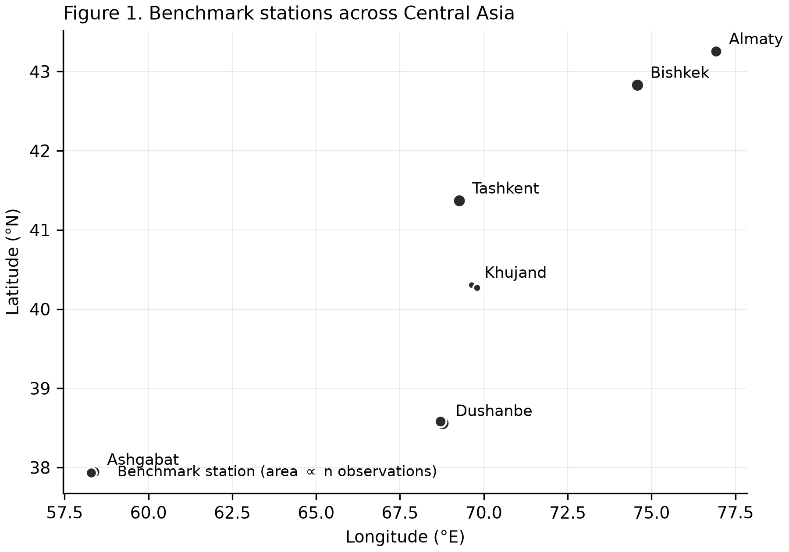
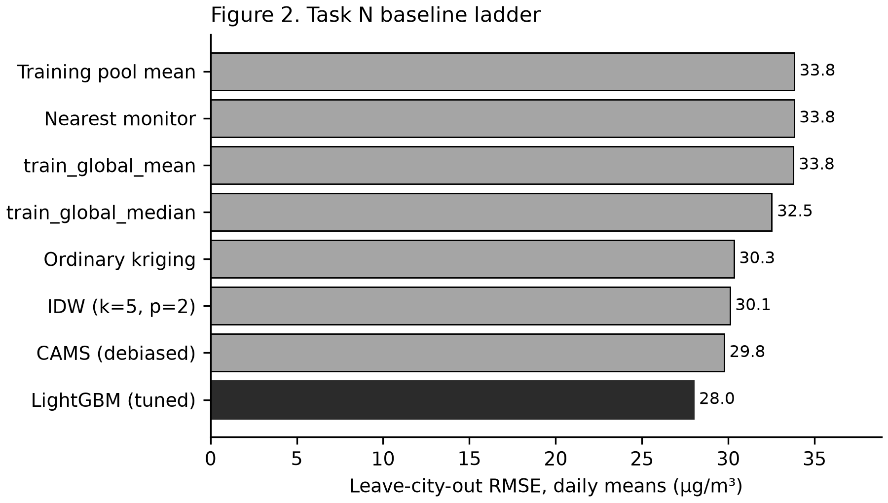
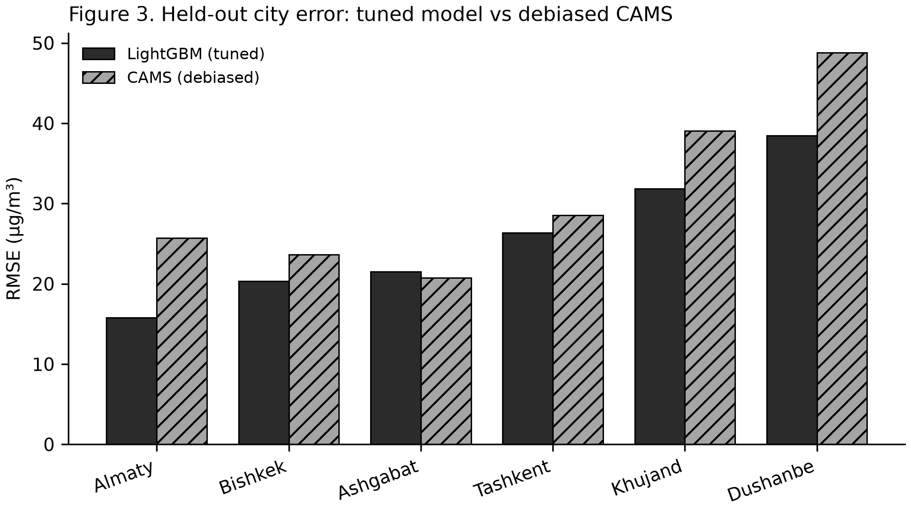
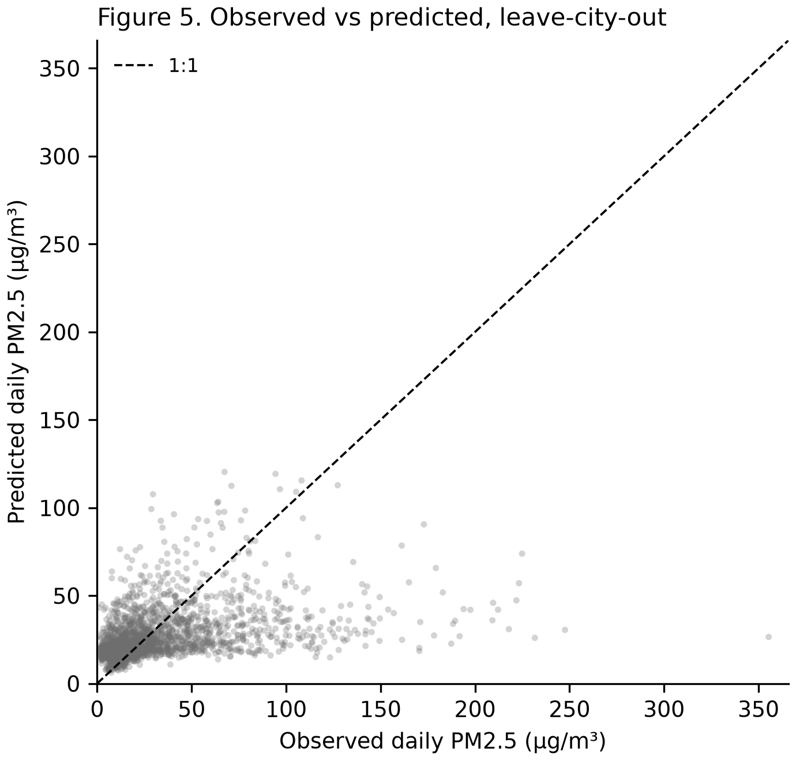
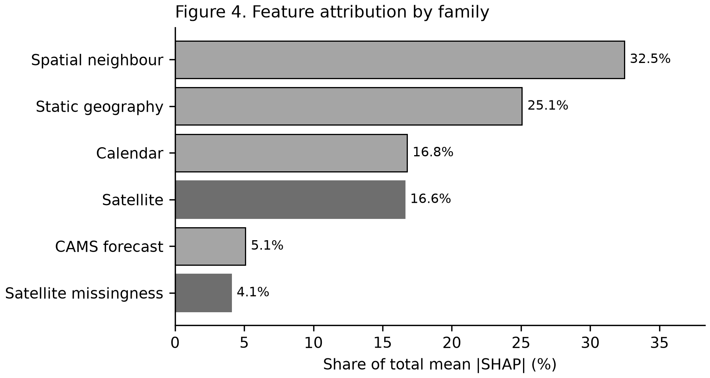

# A Station-Level Air Quality Benchmark for Central Asia

**Frozen leave-city-out splits, an operational-availability account, and a transfer
baseline evaluated under whole-city holdout**

**Jaloliddin Musayev**1,\*, **Asadbek Abdivayitov**2,
**Ozodbek Yo'ldashev**3

1 International House Tashkent Academic Lyceum, Tashkent, Uzbekistan
2 First Specialized Boarding School, Karshi, Uzbekistan
3 National University of Uzbekistan, Tashkent, Uzbekistan

\* Corresponding author: jaloliddin2009applicant@gmail.com
ORCID iDs: Jaloliddin Musayev 0009-0003-0210-3687; Asadbek Abdivayitov 0009-0006-3484-3438.

---

## Abstract

Central Asia carries some of the highest particulate burdens on earth and some of the
sparsest monitoring, yet no open station-level benchmark exists against which competing
estimation methods can be compared on identical terms. Regional results are typically
reported under random cross-validation, which places observations from the same station on
both sides of the split, answering a question about interpolation while appearing to answer
one about unmonitored locations.

We present a reproducible benchmark over 7 instruments in
6 cities -- 5 reference-grade US-embassy monitors and
2 low-cost sensors in Khujand -- 2018-11-27 to 2024-12-31. Splits are frozen and checksummed
before the reported results were produced: blocked-temporal with a purge gap of 240
hours from the maximum feature lag and horizon, plus leave-city-out over 6
folds. Nowcasting at unmonitored sites and forecasting at monitored stations are defined
separately and never pooled. Ground observations are fused with satellite retrievals,
a chemistry-transport forecast and static geography, each carrying a
measured acquisition latency that governs admissibility.

Against a mandatory baseline ladder scored at a single temporal resolution, tuned gradient
boosting reaches RMSE 28.01 ± 0.35 µg/m³ at
unmonitored locations, the lowest of all 6 admissible baselines including
inverse-distance weighting (29.44 µg/m³) — though that ordering is not
statistically separable (paired *p* = 0.586) and reverses if one city is removed.
The advantage over
bias-corrected CAMS is **not statistically significant** once the city — the unit this
protocol generalises over — is the unit of analysis (paired *t* on 6 city means,
*p* = 0.1392; exact permutation *p* = 0.1250), and mean per-fold
R² is -0.04 with 3 of 6 folds
negative: the model ranks first on error while explaining little within-city day-to-day
variation. Further results are
reported against interest: at a 61.8% exceedance base rate a constant
always-exceed classifier already scores F1 = 0.741, and the best credential-free
nowcaster clears that floor by only 0.034; no feature family dominates attribution, with satellite
products (26.6%) ahead of calendar terms (22.2%), static
geography (21.8%) and spatial neighbours
(20.4%); and measured latency invalidated three of five initial
availability assumptions. The contribution is the fixed evaluation protocol, and the
shortcuts fixing it forecloses.

**Keywords:** air quality; PM2.5; Central Asia; machine learning benchmark; spatial
cross-validation; leave-city-out; satellite remote sensing; reproducibility

> **Reproduction.** Every figure below is regenerated by `make reproduce` (or `python tasks.py reproduce`) from the frozen splits in `benchmark/splits/splits.json`, checksum `544a044c…f9e0c6c`. No number in this document is typed by hand.

---

# 1. Introduction

## 1.1 The gap

Central Asia is among the most polluted inhabited regions on earth. It is also among the
least instrumented. Tursumbayeva et al. (2023) put annual PM2.5 in six regional capitals at
4.3–12.6 times the WHO 2021 guideline and trace the burden mainly to coal combustion rather
than transport, contradicting the official emissions inventories. Source-apportionment studies across the region reach the same conclusion independently, in
Kazakhstan (Tursun et al., 2025) and Tajikistan (Papagiannis et al., 2024). The monitoring
base under those numbers is thin and unevenly open. Turkmenistan runs no national air quality network
at all. Kazakhstan releases its data only to users physically inside the country. Only
Kyrgyzstan publishes in a fully open form (OpenAQ, 2025).

Estimates are not what the region lacks. Global gridded products
(van Donkelaar et al., 2021) already assign PM2.5 values
across Central Asia, and the epidemiological literature consumes them. What nobody can do is
check those estimates, or set two methods against each other on identical terms. There is no
open station-level benchmark for the region. No frozen splits, no declared protocol, no
shared evaluation.

The cost of that absence is measurable. Consider the closest environmental analogue in the
literature: PM2.5 estimation across Xinjiang, an arid, dust-affected, sparsely monitored
region much like this one. Jin et al. (2022) report R² between 0.73 and 0.81 under 10-fold
cross-validation with no spatial stratification. With 41 stations in 16 cities and 8-day
averaging, that design places observations from the same station, frequently the same
window, on both sides of the split. The number answers one question. How well can we
interpolate among stations we already have? Readers take it as answering a different one:
how well can we estimate where no monitor exists? Nothing in a reported R² separates the two.

This is not a complaint about one paper. Roberts et al. (2016) show that spatially,
temporally or hierarchically structured data require blocked validation, because ordinary
k-fold leaves dependence straddling the split. Meyer et al. (2019) demonstrate the same for
spatially derived predictors. Alazmi and Rakha (2022) measure the effect directly on
particulate data, running random, spatial and spatiotemporal cross-validation side by side.
Tang et al. (2024) place validation strategy among the systematically overlooked issues in
air quality machine learning. The methodological position taken here is therefore not new.
What the region has never had is a benchmark that enforces it.

## 1.2 What this paper contributes

AQ-Bench (Betancourt et al., 2021) is the precedent: 5,577 stations worldwide, split by
spatial clustering at a 50 km threshold. It targets long-term ozone metrics from station
metadata, a time-independent regression, and it excludes Central Asia entirely. We borrow
its spatial clustering rationale for leave-station-out instead of inventing a second one,
and diverge on pollutant, target, temporal protocol and region. Section 3 states the
differences precisely. AirDelhi (Chauhan et al., 2023) offers a second precedent for
fine-grained particulate benchmarking, confined to a single city.

**C1 — a benchmark.** 7 stations across 6 cities. Splits were frozen
and hashed before the results reported here were produced: blocked-temporal with a derived purge gap,
leave-city-out over 6 folds, and leave-station-out where station density
allows it (2 folds; Almaty, Ashgabat, Bishkek, Dushanbe, Tashkent hold one instrument each and are named
ineligible, not quietly dropped). A test enforces immutability. It fails for the
authors exactly as it fails for anyone else.

**C2 — transfer evaluated without flattery.** We offer no new method. We measure how far
spatial transfer survives into an aerosol regime unlike the source domain, under a protocol
the region has never applied. That framing makes a negative result publishable. Several of
ours are negative.

One fold deserves naming here. Khujand's stations begin after the training block closes, so
the city contributes no training label anywhere in the record. Not one row. The model arrives
with no local history of any kind and has to return a concentration regardless. This is the
harshest test the benchmark contains, and it is also the one that matches the deployment
case the work exists for: an unmonitored city asking for a number it has never been given.
A model that collapses on Khujand has not earned the right to be deployed anywhere new. We
report the fold on its own. Averaging it into the other five would report neither.

Estimating surface PM2.5 from satellite columns is itself an established line of work
(Zang et al., 2017; Xu et al., 2018); what is new here is subjecting it to a spatial
protocol that withholds whole cities.

**C3 — an operational-constraint account.** Every predictor carries a measured latency and a
typed availability flag. Anything that cannot exist at prediction time is barred from
deployable configurations by test rather than by convention.

## 1.3 Findings that shaped the work

Three results shaped the work that follows.

**A constant is hard to beat, and that says more about the region than about the models.**
On health-relevant exceedance, the best credential-free nowcaster clears a trivial
always-exceed predictor by 0.034 of F1. The reason is a base rate rather than skill:
4 of the 6 cities clear the WHO 24-hour guideline on
most test days, up to 88% at Dushanbe, while the other two do
not, as low as 24% at Bishkek, so a classifier that never
varies is correct
most of the time in most of them, and the floor sits at F1 = 0.741 before any
model is fitted. Chronic pollution, not modelling skill, sets
that floor, and a margin that small is not evidence that a model has learned anything past
the regional mean. Raw CAMS, a full chemistry-transport model, is improved in
5 of 6 cities simply by subtracting a per-city
constant, and even after that correction it reaches only R² -0.11. The
exception is instructive: at Bishkek the same correction degrades RMSE from
16.99 to 23.96 µg/m³, which is why the pooled variant rather
than the local one is the legal comparator under leave-city-out. Across two
phases, every baseline we tried sat below the accuracy of predicting the held-out city's own
mean.

**Metric choice reverses conclusions.** RMSE and exceedance skill rank the same models in
nearly opposite orders. Smoothing toward the mean lowers squared error while destroying the
variance needed to tell a bad day from a good one, so a model wins one metric by losing the
other. Report either alone and the ladder comes out backwards for the other task.

**The headline modelling result is mixed, and both halves are reported.** Tuned gradient
boosting with spatial neighbour encodings reaches RMSE 28.01 ±
0.35 µg/m³ at unmonitored locations, ahead of every admissible
baseline — including inverse-distance weighting at 29.44 µg/m³, a
margin of 1.43 µg/m³. That is a real result on error.

It is not a result on skill. Mean per-fold R² is -0.04, ranging
-0.55 to 0.52, with 3 of 6 folds
negative — in those cities the model does worse than a flat line through the city's own mean.
Ranking first on RMSE while explaining little within-city variation is not a contradiction:
most of the achievable error reduction in this region is in getting a city's *level* right,
which is precisely what a benchmark built on whole-city holdout is designed to expose.

Its comparison against bias-corrected CAMS (29.77 µg/m³) is not significant
under the unit of generalisation this protocol is built on: a paired test over
6 city means gives *p* = 0.1392, and an exact permutation test
0.1250. Per-fold Diebold–Mariano tests do clear 0.05 individually, but six
tests are run and **only 3 of 6 survive Holm correction**. We
report the corrected count, not the raw one.

## 1.4 What this paper does not claim

We do not claim state of the art. No like-for-like comparison exists on these splits, for
the plain reason that we are the ones creating them. Nor do we claim to introduce transfer
learning for data-poor regions. Gupta et al. (2024) hold that ground already, proposing a
latent dependency factor for spatial transfer of PM2.5 estimation and reporting a 19.34%
gain over baselines across ten target sensors against eastern-US source data. Theirs is a
method paper, not a benchmark, and it defines no reusable public split. What remains
available to us is the evaluation protocol and the region, not the idea. Related transfer approaches have since been reported for other data-sparse settings,
including African cities (Mazuruse et al., 2026) and hybrid deep architectures
(Ni et al., 2022). We also decline to
compare our figures against published R² values obtained under random cross-validation. A
leave-city-out number and a random-CV number are not commensurable, and treating them as
though they were is the precise error this benchmark exists to prevent.

**One piece of prior art we cannot resolve.** A 2025 conference abstract claims the first
machine-learning PM2.5 prediction for Tashkent, using ten automated stations with weather
and seasonal inputs. We could not obtain it. The publisher returns HTTP 403, and the record
appears in none of OpenAlex, Crossref, Semantic Scholar or Europe PMC. **Its split protocol
is unverified.** We therefore make no claim about what that work did or did not do, and we
specifically do not assert priority for applying leave-city-out to Tashkent. Should it prove
to be spatially stratified, the novelty of C1 narrows to the multi-city benchmark, not
the city. Section 7 carries this as an open item.

---

# 2. Data, Operational Constraints, and Informative Missingness

## 2.1 Ground truth

PM2.5 comes from 7 instruments across 6 cities: Almaty,
Ashgabat, Bishkek, Dushanbe, Khujand and Tashkent. **5 are
US diplomatic-post reference monitors and 2 are Clarity low-cost
sensors (Khujand)** — see Section 7.2. The embassy monitors are the only consistent
multi-country reference in the region and the sole route to any measurement in Turkmenistan.

That network contracted sharply in March 2025, when the StateAir publication channel closed.
Five of the ten contributing source feeds stop on 2025-03-04, and after co-published feeds
are merged **2 of 7 benchmark stations
(8881, Bishkek) end there**; the rest survive through a longer-lived feed.
Reporting states that seventeen years of archive were subsequently removed from the
originating platform.

The closure was not uniform, and an earlier claim here that the programme had simply ended is
withdrawn. A live query on 2026-08-14 found three of the same diplomatic-post monitors still
republished through the AirNow provider after the StateAir channel closed — Ashgabat to
2025-09-24, Almaty to 2025-11-14, and Dushanbe still reporting — with measurements retrieved
and verified rather than inferred from metadata. The record this benchmark curates is
nevertheless fixed: the panel is frozen, the test year is 2024, and extending it
would change the benchmark and require a version bump rather than a refresh.

**Quality control was pre-registered before the data were inspected**, so no rule could be
tuned to improve a count. Seven rules cover physical range, flatlining, zero-runs, unit
sanity, duplicate identity, timezone correctness and completeness. Two produced findings
worth reporting.

*Duplicate identity, and the case distance could not see.* The embassy monitors are published
twice — once by StateAir, once by AirNow — under distinct identifiers 57 m apart in Bishkek
and 40 m in Ashgabat. Exact coordinate matching does not catch this. Under leave-station-out
the held-out station would have been the same physical device as one in training. Detection is
therefore distance-based at 150 m.

**A distance rule cannot catch the inverse case, and this benchmark contained one.** Dushanbe
was published by the same two programmes, but its two records carry coordinates **6.06 km
apart**, so the 150 m rule passed them and an earlier version of this manuscript cited that
separation as evidence the sites were distinct. They are not. Over the 33,462 hours in which
both report, **94.0% of readings are bit-identical**, and of the remainder
99.9% match exactly
at a five-hour offset — Dushanbe is UTC+5, so those are the same measurements timestamped in
local time rather than UTC. **99.99% of overlapping hours are the same
reading.** The
comparable Khujand pair, 14.4 km apart, is bit-identical on 0.3% of hours.

A second rule (Q5c) was therefore added: flag any station pair whose overlapping observations
are bit-identical on more than half of samples, regardless of separation. Two independent
instruments do not agree to floating point. The Dushanbe records are merged under the same
precedence-and-gap-fill rule already applied to Bishkek and Ashgabat, giving
7 instruments rather than eight, and the benchmark is versioned **1.1.0** to mark
that the split changed. Sections 6 and 7 report how the modelling results moved as a result;
they moved against the model.

*Timezone correctness.* Metadata offsets are not trusted. Each station's diurnal composite is
cross-correlated against a regional reference, and an initial implementation rejected both
Khujand sensors for an apparent 12-hour shift. Investigation showed the regional reference
self-correlates at r = +0.71 under a 12-hour rotation, because Central Asian urban PM2.5 is
bimodal with peaks roughly half a day apart. Whole-shape correlation cannot separate a
half-day offset from none in such a signal. The check now reports lag identifiability and
flags rather than rejects when the hypothesis is not distinguishable — a station was nearly
deleted by a discriminator reporting an artefact.

**Figure 1** shows the station geography; marker area is proportional to the number of
retained hourly observations.

**Figure 1.** Benchmark stations across Central Asia. Marker area is proportional to the
number of retained hourly observations. Six cities span five countries; Turkmenistan
(Ashgabat) and Kazakhstan (Almaty) contribute one station each.

## 2.2 The splits

Train 2018-11-27 to 2022-12-31; validation 2023-01-11 to 2023-12-21; test
2024-01-01 to 2024-12-31. Purge gaps of 240 hours separate the blocks.

**The purge is derived, not chosen.** A training sample at *t* reads features over
[*t*−max_lag, *t*] and predicts *t*+*h*, so the gap must satisfy purge ≥ max_lag +
max_horizon = 168 + 72 = 240 hours. A test
recomputes this from the model definitions, so introducing a model with a longer feature
window fails the build rather than silently leaking across the boundary.

**Test year 2024 is forced by the embassy shutdown.** It is the last complete year
with reference-grade coverage. A post-shutdown block would cover two cities, not six.

**Khujand contributes no training rows at all.** Both its stations begin in late 2023, after
the training block closes, so Khujand appears only in validation and test. This passed the
completeness rule because that rule checks span and coverage, not overlap with the training
block. We retain it deliberately: it constitutes a pure zero-shot spatial transfer fold, in
which the model has no local history in any form. Its fold is strictly harder than the
others and is reported separately rather than averaged in.

## 2.3 Operational availability as a typed property

Reanalysis products describe exactly the quantities that drive PM2.5, are better documented
than their forecast counterparts, and already sit in most atmospheric pipelines. A model
consuming ERA5 boundary-layer height to predict tomorrow's air quality will post an
excellent number and cannot be deployed. Nothing in its RMSE looks wrong.

Availability is therefore declared per feature and enforced by test. Every measured latency
in this study is given in Table 2.1; **three of five initial estimates were wrong, one by
more than three orders of magnitude.**

| Product | Claimed | Measured | Status |
|---|---:|---:|---|
| MAIAC AOD (Earth Engine, MCD19A2.061) | 6 h | ~8 days | oracle only |
| Sentinel-5P AAI (OFFL) | 5 h | ~72 h | oracle only |
| Sentinel-5P AAI (NRTI) | — | < 24 h | deployable |
| CAMS forecast PM2.5 | 12 h | ~10 h | **deployable** |
| ERA5 reanalysis | ~5 days | 163 h | oracle only |
| VIIRS active fire (v001) | 4 h | **774 days** | superseded |

The VIIRS case is the instructive one, and the latency was the lesser problem. The
originally-mapped collection is deprecated and its final asset falls on 2024-06-16 — dead
centre of the frozen test year, giving 161 images in January–June and **zero** in
July–December. A model using it would have seen fire signal for half the test period and
structurally none for the other half, producing an apparent regime change on 1 July that
invites a meteorological explanation for a dead data feed. A latency check catches the 774
days; only a coverage check against the *frozen* test block catches the mid-block
termination. Both are now enforced.

CAMS products derive from the Copernicus Atmosphere Monitoring Service assimilation and
forecast system (Inness et al., 2019). CAMS requires a second operational distinction: forecast step zero has assimilated
observations at the valid time, so using it to predict that time is lookahead wearing a
forecast label. All CAMS features use the 24-hour lead, which is what a live service holds.

## 2.4 The R7 phenomenon: missingness correlated with the target

Two aerosol regimes operate here and fail retrieval differently: winter coal combustion,
and spring salt-dust transport from the desiccated Aral bed (Banks et al., 2022; Liu et
al., 2025).

Satellite retrieval does not fail at random. It fails during dust, cloud and snow — the
conditions that accompany the highest concentrations. Dropping incomplete rows therefore
conditions the evaluation on *"retrieval succeeded"* and biases every result toward calm,
clear, low-concentration days.

We quantified this across all five satellite features on daily station-matched data. Each
satellite product is extracted onto a complete station × date grid — the compositor emits a
fully-masked image on days with no usable granule rather than omitting the row — so a failed
retrieval is a masked cell, not an absent one, and the grid is the denominator. Rates below
are conditional on the station-day also carrying a ground observation, since that is the
subset on which the association can be tested at all.

| Feature | Retrieval | Δ median PM2.5 on missing days | *p* | Retrieval on worst decile |
|---|---:|---:|---:|---:|
| Sentinel-5P SO₂ | 57.4% | **+10.3** | 1.6e-138 | **14.0%** |
| MAIAC AOD | 62.9% | +5.6 | 1.4e-44 | 38.1% |
| Sentinel-5P NO₂ | 70.7% | +3.3 | 1.7e-14 | 58.0% |
| Sentinel-5P CO | 81.1% | +2.6 | 7.2e-05 | 81.9% |
| Sentinel-5P AAI | 99.8% | +6.8 | 0.75 | 99.9% |

**SO₂ is blind in the season it exists to observe.** It retrieves on 0.1% of December days against
91.0% in July. Retrieval requires ultraviolet signal, and
at 38–43°N in December the solar zenith angle leaves too little; this is a geometric floor,
not a cloud accident. The direct tracer for the region's dominant winter source is
unavailable throughout that source's season. Additionally, 29.8% of the
retrievals that do occur are negative, sitting below the noise floor — clipping them at zero
would bias the coal tracer upward across a third of its observations.

MAIAC (Lyapustin et al., 2018) has been validated specifically over Central Asia
(Chen et al., 2021), which is why it was selected over coarser aerosol products. Its
bright-surface retrieval matters here: much of the study region is high-albedo desert and
seasonal snow, the conditions under which coarser algorithms lose the surface-aerosol
separation.

**The split between clean and contaminated features follows retrieval physics, with one
exception the table forces.** AAI uses ultraviolet reflectance *ratios* rather than
absorption depth (Veefkind et al., 2012), survives winter geometry and cloud, and is the only
product whose missingness is not target-correlated (0.75). CO's 2.3 µm
shortwave-infrared retrieval also survives winter geometry, and its December coverage is far
higher than SO₂'s, but its missingness still carries a detectable association with the
target (7.2e-05), so it is grouped with the contaminated products rather than with AAI.
MAIAC (visible/near-infrared) and the ultraviolet absorption retrievals are contaminated on
both counts.

**The one clean feature is complementary to the contaminated ones.** AOD and AAI are both
present on 62.8% of station-days; AAI alone covers a further 36.9%; neither
is available on 0.1%. Usable satellite coverage therefore rises from
62.8% to 99.9%, and the coverage AAI
adds is concentrated precisely where MAIAC fails.

Consequently missingness is **modelled, never dropped**. Valid-pixel counts are promoted to
features in their own right. They are retained for Task F but **excluded from Task N** — see
Section 5.3, where an ablation showed retrieval-count features to be city-specific rather than
transferable. Section 6 reports attribution for the features actually used, so the
retrieval-count features carry no Task N attribution at all: they were excluded from it. The
evidence that *when* a retrieval failed carries information is their retention in Task F and
the Section 5.3 ablation, not an attribution share.

---

# 3. Benchmark Construction

The benchmark is the primary contribution. This section states what is frozen, what a
submission must satisfy, and which failure modes are enforced mechanically rather than
requested in prose.

## 3.1 What is frozen

`benchmark/splits/splits.json` fixes 7 stations across 6 cities, the
three temporal blocks, 6 leave-city-out folds and 2
leave-station-out folds. It is accompanied by `splits.sha256`. The checksum is verified in
CI and by `make reproduce`; any edit to the split file fails the build.

The split design follows the blocked-validation position of Roberts et al. (2016) for data
with spatial and temporal structure, and adopts the spatial-clustering rationale of AQ-Bench
(Betancourt et al., 2021) for leave-station-out. Leave-one-out protocols carry their own
failure mode — Austin et al. (2025) show that distributional bias can compromise them — which
is why leave-*city*-out, not leave-station-out, is the headline protocol: it holds out a
whole aerosol regime rather than one instrument within a regime.

That position is contested, and the objection is worth stating rather than leaving for a
referee. Wadoux et al. (2021) argue that spatial cross-validation is not the right way to
evaluate map accuracy: where the goal is the accuracy of a map over a fixed population,
spatial blocking is pessimistically biased, and design-based validation on a probability
sample is the correct estimator. We accept that argument on its own terrain and note that it
is not this one. The quantity estimated here is not the accuracy of a map across Central
Asia; it is the error a model incurs in a city that contributed no training row, which is the
question a government asks before trusting an estimate for an unmonitored city. For that
estimand, holding the city out is not a pessimistic proxy for the target quantity. It *is*
the target quantity, and a random split estimates something else. The distinction is between
interpolating within a sampled population and transferring to a location outside it, and this
benchmark exists for the second.

Meyer and Pebesma (2021) supply the complementary framework: a model's area of applicability
is the region of predictor space where its training data support a prediction at all. Section 7
reports that the held-out city's mean bias falls monotonically with its concentration
(Spearman rho = -1.00), while fold RMSE carries no such relation once normalised
by each city's own variability (rho = -0.03). That is an applicability
statement measured rather than named. We report it empirically and flag the
formal treatment as work the benchmark makes possible rather than work it performs.

The checksum is over bytes, which on a mixed-platform repository is not automatic. An early
version was unverifiable because `Path.write_text` applied CRLF translation on Windows, and
the `.gitattributes` fix that followed was itself wrong: for attributes the **last** matching
line wins, the opposite of `.gitignore`. The general `* text=auto` rule must therefore be
declared *before* the `benchmark/splits/** -text` override, not after. This was caught only
by cloning into a temporary directory and running `sha256sum -c` there — an in-place check
passes on a file that no other machine can reproduce.

## 3.1b Relation to the nearest precedent

Section 1.2 defers the comparison with AQ-Bench (Betancourt et al., 2021) to here, because
it is the only prior artefact of this class that was published as a benchmark rather than as
a study, and the separation has to be exact rather than asserted.

| | AQ-Bench (2021) | This benchmark |
|---|---|---|
| Pollutant | Tropospheric ozone | PM2.5 |
| Target | Long-term aggregated metrics | Daily concentration, and hourly for Task F |
| Task | Station metadata to metric, time-independent regression | Nowcasting at unmonitored sites, and short-horizon forecasting |
| Region | USA, Europe, East Asia | Central Asia, absent from AQ-Bench |
| Spatial protocol | Spatial clustering at a 50 km threshold | Leave-city-out, with leave-station-out where density allows |
| Temporal protocol | None; the task is time-independent | Blocked, with a derived purge gap |
| Stations | 5,577 | 7 instruments in 6 cities |

The one row that is a borrowing rather than a difference is the spatial protocol. AQ-Bench's
50 km clustering threshold is a defensible published rationale for separating stations that
are not independent, and leave-station-out here adopts it rather than inventing a second
threshold with no precedent behind it. Everything else in the table is a divergence, and the
last row is the honest one: this benchmark is three orders of magnitude smaller. It is not a
competitor to AQ-Bench on coverage. It covers a region AQ-Bench excludes, for a pollutant it
does not treat, under a temporal protocol its task does not require.

## 3.2 Two tasks, never pooled

| | Task N — nowcasting | Task F — forecasting |
|---|---|---|
| Question | concentration at an **unmonitored** location, now | concentration at a **monitored** station, later |
| Protocol | leave-city-out | blocked temporal, t+24 h, t+48 h, t+72 h |
| Target history | **inadmissible** | admissible |
| Spatial features | admissible (neighbours exclude the held-out city) | admissible |

Under leave-city-out the held-out city contributes no
label, so a local autoregressive lag is undefined at inference — not merely optimistic, but
unavailable. Under blocked-temporal forecasting the same lag is exactly what a deployed
service holds. A single table containing both tasks would compare models with access to the
target's own history against models without it, and the resulting ranking would be an
artefact of that asymmetry. The two are reported separately throughout, and a test asserts
that no results file mixes them.

## 3.3 The purge gap is derived

Purge = max_lag + max_horizon = 168 + 72 =
240 hours, applied at both block boundaries. A test recomputes this from the
registered model definitions rather than reading a constant, so adding a model with a longer
feature window fails the build instead of quietly leaking across the boundary. The failure
mode this prevents runs in both directions across a boundary: a training row's forecast
horizon reaching forward into the block that follows, so that its label is a value the next
block is meant to hold out; and a test row's feature window reaching back into the block
before, so that its inputs are built from labels the model was tuned on. The purge width is
the sum of the two reaches.

## 3.4 Feature admissibility is typed, not documented

Every feature carries `available_at_runtime` and `latency_hours` as properties, and feature
sets are constructed by filtering on them:

- `static_only` — geography and land surface; no temporal input at all
- `deployable` — everything a live service can hold at inference time
- `benchmark_retrospective` — adds products whose latency exceeds the forecast horizon
- `reanalysis_oracle` — deliberately inadmissible; exists to quantify the gap

The oracle set is retained precisely because it is not deployable. Reporting it alongside
the deployable set converts an invisible methodological error into a measured quantity: the
difference between the two is the cost of the operational constraint, and Section 6 reports
it. A guard test constructs a contaminated feature set and asserts the admissibility check
rejects it, so the check cannot silently degrade into a no-op.

## 3.5 Khujand: zero-shot spatial transfer

Both Khujand stations begin after the training block closes, so Khujand appears only in
validation and test. Its leave-city-out fold is therefore strictly harder than the other
five: the fitted model sees no Khujand row anywhere, not merely no label in the current fold.

One qualification belongs with that, because the zero-shot framing rests on it. The two
global configuration freezes described in Section 5.3 — the `log1p` target and the exclusion
of the retrieval-count features — were selected by scripts that score candidates on the
held-out city's own validation block rather than on the training cities'. Khujand's 2023
observations therefore informed those two choices, though no Khujand row entered any model
fit and the 2024 test block was untouched by either selection. Per-fold hyperparameter tuning
does not have this property: it validates on the training cities only. We state the
distinction rather than let "zero-shot" carry more than it should.

We retain it as a distinct evaluation regime rather than repairing it. Every other fold
measures interpolation between cities the model has seen at some point in training; Khujand
measures extrapolation to a city that never appears. Averaging the two would report neither.
Khujand is reported both inside the pooled figure and separately, and its fold is labelled
zero-shot wherever it appears.

## 3.6 What a submission must report

1. Both tasks, in separate tables, with the ladder of Section 4 included.
2. Mean ± standard deviation over at least five seeds. Deterministic models report `(det.)`
   rather than `± 0.000`, so that a zero is never mistaken for a measured variance.
3. Per-city results, not only the pooled figure. Six cities with different aerosol regimes
   averaged into one number hides the variation that matters.
4. Diebold–Mariano tests (Diebold and Mariano, 1995) for any claimed improvement, with the
   truncation lag stated, Newey–West HAC variance (Newey and West, 1987) and the
   Harvey–Leybourne–Newbold small-sample correction (Harvey et al., 1997). Section 6.2
   shows why the lag cannot be left at its default: setting it to zero inflated our
   *p*-values by seven orders of magnitude.
5. Exceedance metrics accompanied by the trivial-classifier score and Peirce skill
   (Section 4.3), because F1 alone does not establish skill.
6. A statement of which feature set was used, from the four above.

## 3.7 Reproduction

`make reproduce` runs the pipeline end to end: lint, type check, the full test suite,
checksum verification, split regeneration, the baseline ladder, **the model layer** (untuned
and tuned gradient boosting, the CAMS variants, and the significance analysis), table
regeneration and manuscript rendering — in that order, because splits are hash-verified
before any model reads data. Every number in this paper is produced by that command. No
figure in the manuscript is typed by hand; Section 7.5 describes the mechanism and the drift
it caught. The command is idempotent: a second run reproduces all
31 result tables **byte-identically**, verified by SHA-256.

**A reproducibility failure this paper had to fix in itself.** Until benchmark v1.1.0 the
model layer was *absent* from `make reproduce`. Its four producers wrote files under names
that were then renamed by hand into the names the manuscript cites, so the command
regenerated only the Section 3 baseline tables and still exited 0 — while every headline
table sat unchanged on disk. The claim "every number is produced by that command" was
therefore false when first published, not because any number was fabricated (all of them
regenerate exactly) but because the chain that was supposed to guarantee it had a gap. Each
producer now writes the name the paper cites, the rename step is gone, and a test asserts
that every table read by the manuscript has a producer inside the reproduction chain. We
report this because a reproducibility claim that has never been executed end to end is
exactly the kind of claim this benchmark exists to make checkable.

**On the ordering of the freeze.** The splits carry a signed timestamp and are immutable by
test. What the repository can prove is that **the modelling results reported here were
produced after the splits were frozen and hash-verified**. It cannot prove the stronger
claim, made in earlier drafts, that no model had been fitted on any data before the freeze:
model *code* is committed roughly twelve hours before the freeze timestamp, no result
artefact is under version control from that period, and the split builder was committed in
the same commit as the splits. We therefore state the weaker claim, which the evidence
supports, and flag the stronger one as unverifiable. A future benchmark version should
record run manifests with content hashes so the ordering is provable rather than asserted.

**What that command does and does not require.** The frozen splits are committed, so
*verifying* the benchmark needs neither credentials nor a rebuild — `sha256sum -c
splits.sha256` is sufficient, and the test suite runs offline against committed fixtures.
*Regenerating* the numbers additionally requires the derived ground-truth panel, which is
built from the OpenAQ archive with an API key. That panel is not redistributed here because
the per-feed licence terms are heterogeneous and four of the ten feeds carry no licence
record at all (the matrix, retrieved 2026-08-14, is in `data/MANIFEST.md`); the same file
records the
provenance and `README.md` the three commands that rebuild it, and the two further accounts the predictor layer needs. Running the pipeline without
it fails with those instructions rather than a missing-file traceback. We state this
explicitly because "one command reproduces everything" is a claim reviewers test, and it is
true only after that acquisition step.

Two properties of that command are load-bearing and were not true of earlier versions.
First, it **regenerates the manuscript, not only the tables**: an earlier `paper` target
stopped after building the CSVs, so the rendered sections were never rebuilt from the
figures `reproduce` had just recomputed, and the zero-drift guarantee held only halfway.
Second, a missing tool is a **failure, not a skip** — the task runner once printed
`SKIP (not installed)` and continued, so on a machine without `ruff` the command exited 0
having verified nothing. A reproduction harness that passes without doing the work is worse
than no harness, because it converts an unrun check into a green light.

Environment setup is `python scripts/setup_env.py`, which works with or without `uv` and
locates a Python 3.12 by *executing* candidate interpreters rather than trusting a registry.
On our own Windows machine the `py` launcher advertised a 3.12 runtime that failed to start.
Where `make` is unavailable, `python tasks.py <target>` runs the identical commands — the
Makefile delegates to the same table, so the two cannot diverge.

---

# 4. The Baseline Ladder

A learned model is only interesting relative to what it beats. This section reports the
mandatory ladder — persistence, climatology, raw chemistry-transport, and the spatial
interpolators — before any learned model appears. The requirement is not a house rule.
WeatherBench (Rasp et al., 2020) established the same discipline for data-driven weather
forecasting: a benchmark ships persistence, climatology and an operational physical model
alongside the data, so that a later method is measured against what the field already has
rather than against whatever the authors chose to include. The ladder here is that
convention applied to a pollutant and a region where it had not been. Every rung is credential-free and
deterministic, so seed variance is zero by construction and is reported as `(det.)` rather
than as a measured `± 0.000`.

## 4.1 Task F — forecasting at monitored stations

Test block 2024, horizons t+24 h, t+48 h, t+72 h, pooled across stations.

| Model | RMSE (µg/m³) | R² |
|---|---:|---:|
| persistence, y(t) | 40.14 | -0.34 |
| diurnal persistence, y(t−24 h) | 40.14 | -0.34 |
| climatology (station mean) | 36.24 | -0.15 |
| same-hour 7-day mean | 33.23 | 0.11 |

**Persistence and diurnal persistence are numerically identical, and this is correct.** All
three evaluated horizons are multiples of 24 h, so "the same hour yesterday" and "lag-24
persistence" resolve to the same timestamp. The Diebold–Mariano procedure reports them as
exact ties — the loss differential is identically zero and the test statistic is undefined
rather than insignificant. We report the degeneracy rather than dropping a rung, because a
ladder in which two rungs coincide at the evaluated horizons is a property of the horizon
grid that a reader needs in order to interpret the table.

Degradation with lead time is visible only in the persistence family
(37.76 → 41.57 µg/m³ from t+24 h to t+72 h).
Climatology is flat by construction at 36.24 µg/m³, since it
does not read the recent past. **Only the same-hour 7-day mean achieves positive R²**
(0.11); every other rung is worse than predicting the test-block
mean.

**Figure 2** shows the full Task N ladder at daily resolution, including the tuned model of
Section 5 for context, so that every bar is comparable with the learned model's. At that
resolution the two interpolators lead the credential-free rungs (IDW
30.10, kriging 30.33 µg/m³) and every
rung sits below the training-pool mean (33.83). The hourly
table in Section 4.2 orders the same methods differently, with kriging alone under the pool
mean, and the two resolutions are not comparable to one another.

**Figure 2.** Task N baseline ladder at daily resolution, leave-city-out mean RMSE (µg/m³),
so that every bar is comparable with the learned model's. Lower is better. The tuned model of
Section 5 is shown in dark fill for context. At this resolution the two interpolators lead
the credential-free rungs (IDW 30.10, kriging
30.33) and the training-pool mean sits at
33.83 µg/m³; the hourly ladder in Section 4.2 orders them
differently and is not comparable to this panel.

## 4.2 Task N — nowcasting under leave-city-out

The held-out city contributes no label. These are pure spatial interpolators, fitted on the
remaining five cities.

| Model | RMSE (µg/m³) | R² | Exceedance F1 | Peirce skill |
|---|---:|---:|---:|---:|
| nearest monitor | 46.66 | -0.79 | 0.753 | 0.436 |
| IDW (k=5, p=2) | 40.86 | -0.26 | 0.775 | 0.378 |
| training-pool mean | 40.69 | -0.24 | 0.741 | 0.000 |
| ordinary kriging | 39.71 | -0.22 | 0.736 | 0.296 |

**Every spatial baseline has negative R².** Interpolating between Central Asian cities
hundreds of kilometres apart is worse than predicting a constant. That is the floor the
task sits on, and it is why the leave-city-out result in Section 6 is modest.

**The training-pool mean is an explicit rung of the ladder.** It is a constant: the
mean of all training-block labels. It was promoted to the ladder after we observed that it
outranks two of the three genuine interpolators on RMSE (40.69 vs
40.86 and 46.66). Any model that does not clear a
constant has not demonstrated spatial skill, and without this rung in the table the reader
cannot check that.

Kriging attains the best RMSE (39.71) and the **worst** exceedance
F1 (0.736). Optimising squared error pulls predictions toward the
mean, which suppresses exactly the excursions the exceedance metric scores. Reporting one
number without the other would support two opposite conclusions about the same model. We
additionally report the kriging fallback rate: where the system is singular the
implementation silently degrades to IDW, and a column labelled "kriging" that is
substantially IDW underneath is a reporting error rather than a modelling one.

## 4.3 Exceedance F1 does not measure skill

The WHO 2021 24-hour guideline is 15 µg/m³, scored on local-calendar daily means because
that is what the guideline defines. In this region the exceedance base rate is
**61.8%** — exceedance is the common case, not the rare one.

A classifier that predicts "exceeds" unconditionally therefore scores F1 =
**0.741**. The training-pool mean — a constant, carrying no information
whatsoever — scores 0.741, matching that floor to three decimals,
and the whole Task N ladder spans only 0.034 of F1 above it
(idw_k5_p2, 0.775). The training-pool mean's Peirce skill is
0.000, exactly zero, as it must be for any constant.

The consequence reaches past this table: a paper reporting only exceedance F1 on
this region could present a constant as its best classifier and the number would look
respectable. We therefore report, alongside every exceedance F1:

- `f1_trivial_always` — the score of the unconditional classifier on the same rows
- `beats_trivial` — whether the model exceeds it at all
- `base_rate` — so the reader can compute the trivial score independently
- `peirce_skill` — TPR − FPR, which is base-rate independent and **zero for any constant**

Peirce skill separates the ladder in the way F1 does not: nearest monitor
(0.436) and IDW (0.378) carry genuine discriminative
information, while the constant carries none, and the F1 column ranks them in the opposite
order.

## 4.4 CAMS as a baseline

CAMS is the operational chemistry-transport forecast for the region and the strongest
credential-free comparator. It is used at the 24-hour lead throughout: forecast step zero
has assimilated observations at the valid time, so scoring it against that time is lookahead
wearing a forecast label.

| Variant | RMSE (µg/m³) | R² | Bias (µg/m³) |
|---|---:|---:|---:|
| raw | 35.27 | -0.39 | -21.34 |
| locally debiased | 30.35 | -0.18 | -2.71 |
| pooled debiased | 30.68 | -0.11 | -2.71 |

**Raw CAMS under-predicts by -21.34 µg/m³** — a large systematic deficit
consistent with an emissions inventory that does not capture residential coal and biomass
combustion at Central Asian intensity. Removing that bias improves RMSE substantially
(35.27 → 30.35) while R² remains negative
(-0.18): the correction fixes the level, not the timing.

The two debiasing variants are distinguished by protocol. **Local debiasing is admissible
only in Task F**, since it fits a per-city offset on that city's training labels. Under
leave-city-out no such labels exist, so Task N uses the pooled correction fitted with the
held-out city excluded. The pooled variant is the weaker of the two
(30.68 vs 30.35), and reporting the local
figure under a leave-city-out heading would overstate the baseline the learned model must
beat — making the model's margin in Section 6 look smaller than it is, in this direction,
but the protocol violation is the same either way. A test asserts that a bias fitted on the
full record differs from one fitted on the training block, so that a silently-leaking
implementation cannot pass.

---

# 5. Models and Training Protocol

## 5.1 Model class

Gradient-boosted decision trees (LightGBM) are the learned model. The choice is deliberate
and is not a claim that trees are the strongest possible architecture. Three properties
matter for this benchmark:

1. **Native missing-value handling.** Section 2 established that satellite retrieval failure
   is correlated with the target. A model that requires imputation forces a choice between
   discarding the informative rows and inventing values for them; LightGBM learns a default
   direction per split, so missingness is used rather than filled.
2. **Sample efficiency.** Six cities is a small spatial sample. A deep architecture would be
   tuned on validation folds of a few hundred station-days, and the tuning variance would
   exceed the effect being measured.
3. **Attribution that survives inspection.** Section 6 depends on being able to say which
   feature families carry the model, and to show that the answer is uncomfortable.

Reporting a deep model here would require a like-for-like comparison we cannot yet support
at this sample size; the benchmark exists so that such a comparison can be made later on
fixed splits.

## 5.2 Feature families

- **spatial neighbour** — inverse-distance-weighted neighbour concentration, neighbour mean,
  neighbour count. Under leave-city-out the neighbour set **excludes the held-out city**,
  which is enforced by passing the held-out label into the constructor rather than by
  filtering afterwards.
- **static geography** — elevation, terrain basin indices at
  6-city scale, population density, distance to the Aralkum.
- **calendar** — cyclical day-of-year and hour encodings, weekday.
- **satellite** — MAIAC AOD, S5P AAI/NO₂/SO₂/CO.
- **satellite missingness** — valid-pixel counts and retrieval indicators, promoted to
  features in their own right. **Task F only**: excluded from Task N by a frozen decision
  described in Section 5.3.
- **CAMS forecast** — the 24-hour-lead chemistry-transport prediction.

Autoregressive lags of the target are **Task F only**. They are not merely optimistic under
leave-city-out; they are undefined, because the held-out city supplies no history. For Task N
the spatial features above are the only route to target information, and they are
constructed with the held-out city removed.

## 5.3 Tuning and the two frozen configuration choices

Hyperparameters are selected on the 2023-01-11 to 2023-12-21 validation block and then
frozen. The test block 2024-01-01 to 2024-12-31 is read exactly once per reported
configuration. The tuning protocol follows established guidance for tree ensembles (Probst et al., 2019).
No hyperparameter, feature-set choice, or early-stopping decision is made
against test-block performance.

The untuned and tuned configurations are reported side by side below. **They differ in five
respects, not one, and the gap between them must not be read as the effect of hyperparameter
tuning alone.** An earlier version of this manuscript described them as sharing "the same
feature set". That was incorrect. The differences are:

| | Untuned (`train_gbdt.py`) | Tuned (`train_phase5.py`) |
|---|---|---|
| features | tier columns only | tier columns **+ 3 spatial neighbour features** |
| trees | 600 | 800 |
| training rows | train block only (to 2022-12-31) | train block **+ validation block** (to 2023-12-21) |
| hyperparameters | library defaults | grid search, 16 combinations |
| target | raw µg/m³ | **`log1p`, inverted with `expm1`** |

Because the feature set, the tree count, the training window and the target scale all change
together, the untuned-to-tuned difference is a **combined** effect. This paper does not run
the ablation that would separate them, and no causal attribution to tuning is claimed.

**The target transform, stated here because it is the largest of the five.** Daily PM2.5 in
this record has skew 2.79 and excess kurtosis 13.5, so raw-scale squared error is dominated
by a handful of extreme days. Four formulations — raw and `log1p`, each with and without a
residual-against-interpolator variant — were compared across three model families on the
validation block alone; `log1p` won for every family. The choice was frozen before the test
block was touched, and scored once there it moved fold-mean RMSE from 30.24 to 28.05 µg/m³.
**The second frozen choice: retrieval-count features are excluded from Task N.** The
valid-pixel counts and retrieval indicators (Section 2.4) were promoted to predictors because
their missingness is target-correlated. A validation-block ablation then *indicated* that
they harmed leave-city-out generalisation, which is mechanistically plausible: retrieval
success depends on local surface brightness, snow cover and solar geometry, all properties of
a particular city. The exclusion was frozen on that basis and scored once on test, where the
validation gain of 1.75 µg/m³ largely did not carry over: scored on the test
block at the frozen hyperparameters, with and without the features on identical rows and
seeds (`t5_07`), the fold-mean gain is 0.25 µg/m³
(28.26 with the features against 28.01
without), and the sign varies by city, from 3.24 at
Ashgabat to -1.70 at Almaty. An
earlier draft quoted 0.045 for this figure from a run whose outputs were not deposited; the
table replaces it. The configuration
was not reverted after the fact — reverting a frozen choice because the test block disagreed
would be the selection-on-test this section exists to prevent — and the non-replication is
reported rather than removed. The features remain in the Task F set. Section 7.4 returns to
what this does and does not establish.

**Two selection criteria, stated because they differ.** Both frozen choices above were
scored on the held-out city's own validation rows; per-fold hyperparameter tuning is scored
on the training cities' validation rows. Section 3.5 records the consequence for the
zero-shot claim.

**The comparator's information budget is not identical to the model's.** The CAMS bias
offset is fitted on the training block alone, through 2022-12-31; the tuned model it is
compared with is refit on training plus validation, through 2023-12-21. The asymmetry
favours the model by one year of fitting data. It is stated here rather than corrected
because the offset is a single scalar per configuration whose estimate does not move
materially with an extra year, and because refitting the comparator on validation data would
make its per-fold definition depend on the fold in a way the frozen protocol does not
specify. A reader who wants the strictly matched comparison has the code to run it.

Every metric in this paper is computed on the raw µg/m³ scale after inversion, never on the
log scale, and inverted predictions are clipped at zero: `expm1` can return values in
(−1, 0) for a log-scale prediction below zero, and a negative concentration is not a
prediction. Section 7.4b records what that inversion costs.

| Feature set | Untuned RMSE | Tuned RMSE | Untuned R² | Tuned R² |
|---|---:|---:|---:|---:|
| static only | 32.19 | 28.63 | -0.73 | -0.15 |
| deployable | 29.25 | 28.56 | -0.21 | -0.09 |
| retrospective | 29.51 | 28.01 | -0.25 | -0.04 |

The untuned column is retained because it was once used to argue that a poor result would
have been an artefact of library defaults. On benchmark v1.1.0 that argument no longer holds:
the tuned configuration now leads every admissible baseline (Section 6.1), while both
configurations explain little within-city day-to-day variation. The combined
feature-plus-window-plus-hyperparameter change improves RMSE, and RMSE leadership is not by
itself evidence of skill.

## 5.4 Seeds and variance

Every configuration is run with five seeds and reported as mean ± standard deviation. Seed
variance is small: the maximum across configurations is 0.25 µg/m³ for
Task F and 1.79 µg/m³ for Task N.

**Fold-to-fold variance is an order of magnitude larger than seed variance.** The standard
deviation of Task N RMSE across the 6 leave-city-out folds is
11.38 µg/m³, against 1.79 µg/m³ across seeds. Which
city is held out dominates which seed was drawn. A study reporting seed error bars alone
would communicate a precision this benchmark does not have, and per-city results are
therefore mandatory (Section 3.6).

## 5.5 Operational cost of deployability

The deployable feature set excludes every product whose latency exceeds the forecast
horizon; the retrospective set adds them back. The difference is the price of being
deployable:

| Task | Deployable | Retrospective | Cost |
|---|---:|---:|---:|
| N (leave-city-out) | 28.56 | 28.01 | small |
| F (forecasting) | 21.58 | 21.54 | small |

**The cost is negligible in both tasks** — 28.56 against
28.01 µg/m³ under leave-city-out, well inside the fold-to-fold spread
of 11.38 µg/m³. This is a positive result for deployment: the products
excluded by the latency constraint are not the ones carrying the result, so operating under
the constraint costs little. It is not a statement about the satellite family as a whole,
which Section 6.4 reports as the largest single share of attribution.

---

# 6. Results

All figures are on the frozen test block 2024-01-01 to 2024-12-31, five seeds, with
Task N and Task F reported separately throughout.

## 6.1 Task N — leave-city-out nowcasting

| Model | RMSE (µg/m³) | MAE | R² |
|---|---:|---:|---:|
| best spatial baseline (idw_k5_p2, daily) | 30.10 | — | -0.32 |
| training-pool mean (constant, daily) | 33.83 | — | -0.60 |
| CAMS, pooled debias | 29.77 | 21.19 | -0.14 |
| LightGBM, static only | 28.63 ± 0.17 | 18.39 | -0.15 |
| LightGBM, deployable | 28.56 ± 0.52 | 17.72 | -0.09 |
| LightGBM, retrospective | 28.01 ± 0.35 | 17.81 | -0.04 |

Learned-model RMSE is given as **mean ± standard deviation over 5 seeds**, where the
resampled quantity is the whole leave-city-out protocol per seed. Baseline rungs are
deterministic and carry no seed dispersion. Section 3.6 rule 5 requires this of every
submission to the benchmark; it is applied here to the reference implementation as well.

**Two estimators appear in this paper and they are not the same number.** Section 5 and the
table above report the mean over 5 independently seeded runs. Section 6.2 onward,
and every Diebold–Mariano and significance result, score the **5-seed
ensemble**: the seed predictions are averaged first and the average is scored once. Averaging
reduces variance, so the ensemble is the better estimator and its fold-mean RMSE
(27.91 µg/m³) sits below the mean of the single-seed RMSEs
(28.01 µg/m³). Where a ± appears beside a Section 6.2 figure, the
centre is the ensemble and the spread is the dispersion of the single-seed runs around their
own mean — the spread describes the seed-to-seed variability of the procedure, not the
uncertainty of the ensemble, which is narrower and is not estimated here.

**Two numbers describe this result, and they point in opposite directions.**

*Between cities, the model retains some signal.* Pooled over all evaluation rows — variance
measured against the global mean — it explains **R² = 0.13**. Part of the
contrast between a Dushanbe and a Bishkek is learnable from geography, satellite retrievals
and neighbouring monitors.

*Within a city, it is inconsistent.* The headline **R² = -0.04** is the
**mean of the 6 per-fold R² values**, each computed against *that city's own*
mean. Scored this way the model must explain day-to-day variation inside a city it has never
seen. The spread is wide — **-0.55 to 0.52**, with
3 of 6 folds negative (Section 6.1c). It succeeds in some
held-out cities and does worse than a flat line through the city's own mean in others, and the
average of those outcomes is near zero.

The two statistics are not in conflict; they answer different questions, and only the second
is the task this benchmark defines. The correct summary is that **the model captures some
between-city variation and within-city skill that does not generalise across cities.** A
reader given only the pooled figure would substantially overestimate what it does.

**The learned model has the lowest RMSE of any admissible method, and that ranking is not
robust.** Both halves matter and both are reported.

Scored on identical rows at identical resolution it reaches
28.01 ± 0.35 µg/m³ against
29.44 µg/m³ for the strongest legal rung (`idw_k5_p2`),
a margin of 1.43 µg/m³, and it leads all 6 legal
rungs on the fold mean.

But a fold mean is an average over 6 numbers, and the per-city differences are
much larger than the average of them. Against inverse-distance weighting the model is better
in 4 of 6 cities, with per-fold differences ranging from
-10.73 to +5.10 µg/m³. A paired *t*-test over the
6 per-city RMSEs gives ***p* = 0.586** — the margin is **not
statistically distinguishable from zero** at the unit of generalisation this benchmark is
built on. This test pairs RMSE, not the squared-error differential the CAMS comparison in
Section 6.2b pairs; the two are both city-level and are not the same functional. Removing any single city and
recomputing, the model still leads inverse-distance weighting in
5 of 6 subsets; in the remaining one the ordering reverses.

The margin is, however, **4.1× the seed standard deviation**
(0.35 µg/m³), so it is not an artefact of random initialisation —
it is fold-to-fold heterogeneity, not run-to-run noise. Restricting to the five
reference-grade cities and excluding the low-cost Khujand fold, the model leads more clearly
(25.84 against 28.51 µg/m³).

**The defensible claim is therefore "lowest RMSE among admissible methods on this fold set",
not "better than spatial interpolation".** With 6 cities the benchmark cannot
separate those two statements, and Section 6.2b makes the same point about the CAMS
comparison. Full robustness table: `t7_05_ranking_robustness.csv`.

For reference, a constant equal to *the held-out city's own test-block mean* scores
28.12 µg/m³. **That predictor is not legal and is not a baseline.** Under
leave-city-out the held-out city contributes no training label anywhere in the record, so its
mean cannot be known at prediction time; it is reported as a diagnostic floor — the share of
error that is pure within-city day-to-day variance — and the model is within
0.11 µg/m³ of it. An earlier version of this manuscript compared the model
against that oracle and reported it as losing to "a constant". That comparison was invalid,
and the correction is stated here rather than quietly dropped.

Three corrections to this comparison were needed:

1. Earlier drafts placed daily model scores beside baselines scored on *hourly* observations.
   Averaging removes within-day variance, so hourly RMSE is structurally larger; the apparent
   margin was arithmetic, not skill.
2. The comparison predated benchmark v1.1.0, in which the two Dushanbe records
   were found to be one instrument and merged (Section 2). Every fold's RMSE rose once the
   duplicate was gone.
3. The constant used was an oracle, as above.

## 6.1b The baseline ladder at a single resolution

Every rung below is scored on **the same daily evaluation rows as the learned model**
(local-calendar daily means, ≥18 hours, the frozen 2024 test block). Table 6.1 above and the
hourly ladder in Section 4.2 are not comparable to each other and are no longer presented as one
ladder.

| Model (daily, leave-city-out) | RMSE µg/m³ |
|---|---:|
| nearest_monitor | 33.50 |
| training_pool_mean | 32.75 |
| train_global_mean | 32.70 |
| train_global_median | 30.99 |
| ordinary_kriging | 29.75 |
| idw_k5_p2 | 29.44 |
| **LightGBM, retrospective (log target)** | **28.01** |

## 6.1c Per-fold R², including the negative folds

Section 3.6 requires per-city reporting from every submission to this benchmark. The same rule
is applied here.

| Held-out city | R² (vs that city's own mean) |
|---|---:|
| Bishkek | -0.549 |
| Dushanbe | -0.341 |
| Ashgabat | -0.247 |
| Khujand | +0.128 |
| Tashkent | +0.323 |
| Almaty | +0.517 |

3 of 6 folds are negative: in those cities the model is
worse than predicting the city's own average. Averaging them into a single figure conceals
that, which is why both the spread and the mean are reported.

## 6.2 Per-city results and the Diebold–Mariano tests

Pooling six cities into one number hides the finding.

| Held-out city | LightGBM RMSE | CAMS RMSE | DM statistic | *p* |
|---|---:|---:|---:|---:|
| Almaty | 15.30 ± 1.31 | 23.25 | -4.06 | 0.0001 |
| Ashgabat | 20.74 ± 0.20 | 18.83 | 1.17 | 0.2420 |
| Bishkek | 20.21 ± 0.39 | 20.03 | 0.15 | 0.8805 |
| Dushanbe | 46.94 ± 0.79 | 47.96 | -2.65 | 0.0085 |
| Khujand (zero-shot) | 38.81 ± 0.12 | 39.90 | -2.03 | 0.0430 |
| Tashkent | 25.46 ± 0.60 | 28.63 | -2.82 | 0.0050 |
| **pooled** (n = 2214) | **31.49** | **33.07** | **-4.38** | **< 0.0001** |

Tests use Newey–West HAC variance with the Harvey–Leybourne–Newbold small-sample
correction. Negative statistics favour the learned model. One limitation of the test is
stated here rather than left for a reader to raise: Diebold (2015) notes that the DM
procedure was constructed to compare *given* forecasts, and that applying it to *estimated*
models is its most common misuse. Both comparators here are estimated on training data, so
the per-fold DM statistics below are read as descriptive diagnostics. The paper's inferential
claim is the city-level test in Section 6.2b, not these. Six folds are tested, so per-fold
*p*-values are additionally reported with a Holm step-down correction (Holm, 1979) in
`t6_07_per_fold_holm.csv`; **3 of 6 survive it at α = 0.05.**
The correction family is the 6 per-fold comparisons of the same model pair,
declared here because a family chosen after seeing the *p*-values is not a correction. It is
the only corrected family. The deposited tables carry 378 *p*-values in
total, across the hourly ladders, the lag-sensitivity sweeps and the robustness checks; those
are reported as descriptive diagnostics and no inferential claim in this paper rests on any of
them individually. The paper's inference is the city-level primary analysis of Section 6.2b.

### 6.2b Which *p*-value is the paper's claim

The pooled row above treats 2214 station-days from 6 cities as
independent observations. They are not, in either dimension: the loss differential has
first-order autocorrelation 0.25 within station, and station-days cluster within
cities that contribute very unequal row counts. **That pooled figure is reported for
continuity with the per-fold rows above and is not the paper's inferential claim.**

The estimand is the reduction in squared error at *a city with no local training labels*, so
the unit of generalisation is the **city** — as Section 5.4 already argues, and as the
leave-city-out protocol implies. The primary analysis therefore aggregates to one value per
city and tests those 6 numbers.

The quantity tested is the loss differential Δ, the model's squared error minus debiased
CAMS's, in (µg/m³)². Negative values favour the model.

| | Test | Unit | *n* | Δ (95% CI) | *p* |
|---|---|---|---:|---:|---:|
| **Primary** | paired *t* on city means | city | 6 | **-96.2 (-237.0, +44.5)** | **0.1392** |
| **Primary** | exact sign-flip permutation | city | 6 | **-96.2** | **0.1250** |
| Sensitivity | station-day, independence assumed | station-day | 2214 | -101.7 (-133.3, -70.2) | 2.6e-10 |
| Sensitivity | station-day, Newey–West HAC (lag 60 d) | station-day | 2214 | -101.7 (-171.7, -31.7) | 0.0044 |
| Sensitivity | cluster bootstrap over cities | city | 6 | -96.2 (-196.5, -2.9) | 0.0428 |

**The interval is the more informative half of the primary row.** At
(-237.0, +44.5) (µg/m³)² it spans zero and is wide enough to contain both a substantial
improvement over CAMS and a moderate degradation. The study does not establish that the model
is better, and it equally does not establish that it is not: with 6 cities the
design cannot separate those cases. Reporting only *p* = 0.1392 would invite the
reading that no effect exists, which the interval does not support either.

With 6 clusters, cluster-robust asymptotics are unreliable — the cluster-robust
variance estimator is materially downward-biased below roughly 30–50 clusters
(Cameron and Miller, 2015). Two remedies appropriate at this cluster count are reported
together: a *t*-test on 6 city means with 5 degrees of freedom,
and an exact sign-flip permutation test. That test is distribution-free but not
assumption-free: it trades normality for the weaker requirement that each city's mean
differential be sign-symmetric about zero under the null, and at 6 cities that
requirement is no more checkable than normality was. Its smallest attainable two-sided
*p*-value is 0.03125, a floor imposed by having only 6 cities; we state
it rather than let a reader mistake it for evidence.

**The evidence is suggestive and does not reach conventional significance under either
procedure this benchmark treats as primary.** Corrections for serial dependence alone leave
the station-day result significant. At the city level the two primary procedures do not
(paired *t* *p* = 0.1392, exact permutation *p* = 0.1250), while
a percentile cluster bootstrap over the same 6 cities returns
*p* = 0.0428. We report all of them rather than the smallest. The percentile bootstrap
is the least trustworthy of the three here for the same reason the cluster-robust estimator
is: 6 clusters is too few to resample, and the interval it produces is
anti-conservative. The divergence is a real property of a study with six cities, not a defect
to be resolved by choosing a number.

**The pooled station-day improvement is significant (< 0.0001), which is not the
paper's inferential claim (Section 6.2b); 4 of
6 individual folds are, and 3 of those survive Holm correction.**
Almaty, Tashkent (*p* = 0.0050) and Dushanbe hold after correction. Khujand
(*p* = 0.0430) is significant uncorrected and is not after it, and we report it on
that footing below.

**In Ashgabat and Bishkek the sign is reversed and CAMS returns the lower RMSE.** At
Ashgabat that is 18.83 against 20.74 µg/m³ (DM statistic
1.17, *p* = 0.2420); at Bishkek the gap is smaller still and the
test cannot separate it from zero (*p* = 0.8805). Neither reversal approaches
significance. That is not a finding that the two methods perform alike there: at Ashgabat
CAMS holds a 10% RMSE advantage on 263 station-days, and a per-fold test at
this sample size can neither confirm nor exclude a difference of that size. The reversals are
not separable from zero, which is a weaker statement than CAMS winning and a weaker one than
the two being equal.

**Khujand, the zero-shot fold, clears significance before Holm correction
(0.0430) and not after it** at 38.81 µg/m³ against CAMS at
39.90. A city with no training rows anywhere in the record is predicted at
least as well as the operational chemistry-transport model predicts it, which is the finding
worth having. We stop short of calling it an improvement, because the correction removes it.
It remains among the hardest folds in absolute terms, second only to Dushanbe.

**Truncation-lag sensitivity.** The daily comparisons in Table 6.2 use the automatic
Newey–West bandwidth, floor(4(n/100)^(2/9)), which at n = 2214 is 7 days. An
earlier hourly implementation instead derived the lag from the forecast horizon and passed
`horizon_hours = 1` for the nowcasting task, which
disables the HAC correction entirely and inflated *p*-values by roughly seven orders of
magnitude. We now report the full sensitivity sweep: across truncation lags of
0 to 60 days the pooled conclusion is stable (the `truncation_lag_h` column name in
`t6_03` is a carry-over from the hourly implementation; on the daily series these are lags in
days), with all comparisons significant
(yes) and a worst-case *p* of 0.0056.

**Figure 3** gives the per-city comparison against debiased CAMS, and **Figure 5** the
observed-versus-predicted scatter with the 1:1 line. The compression toward the mean
visible in Figure 5 is consistent with the RMSE/exceedance divergence of Section 4.3, which
was measured on the baseline ladder; whether it is the same effect is not tested here.

**Figure 3.** Held-out city RMSE (µg/m³), tuned LightGBM against debiased CAMS.
Ashgabat and Bishkek are the folds where the sign reverses; in neither is the
difference statistically separable.

**Figure 5.** Observed against predicted daily mean PM2.5 (µg/m³) under leave-city-out,
with the 1:1 line. Compression toward the mean is visible at high observed values, the
same pattern Section 4.3 reports for the baseline ladder's RMSE/exceedance divergence.

## 6.3 Task F — forecasting at monitored stations

**What Task F is, precisely.** The learned Task F model predicts the **daily** mean at a
monitored station from that station's own history at lags of 1, 2 and 7 days plus 7- and
30-day rolling means. Its shortest lag is one day, so it is a **single-horizon, next-day
(24 h) forecast evaluated at daily resolution**.

It is therefore **not comparable to the Task F baseline ladder in Section 4.1**, which is
resolved across three horizons (24, 48 and 72 h) and scored on hourly observations
(115,381 observations, against 2,214 daily rows for the model).
Earlier drafts placed the two in one table. They measure different things at different
resolutions, and the baseline row has been removed rather than rescaled: no honest rescaling
exists, because the model does not produce 48 h or 72 h forecasts at all. Extending it to the
full horizon set is left as future work and is not claimed here.

| Feature set (daily, next-day horizon) | RMSE (µg/m³) | R² |
|---|---:|---:|
| LightGBM, static only | 22.03 | 0.58 |
| LightGBM, deployable | 21.58 | 0.59 |
| LightGBM, retrospective | 21.54 | 0.60 |

Task F is the easier problem and the numbers say so: R² = 0.60 against
-0.04 for Task N. **These two figures must never be quoted together as
though they described one system.** The Task F model may read the station's own recent
history; the Task N model is predicting a city it has never seen. Reporting
21.54 µg/m³ as "the model's accuracy" would describe a capability the
deployment does not have at unmonitored locations, which is the case the artefact exists to
serve.

## 6.4 SHAP attribution: what actually carries the model

Attribution uses SHAP values (Lundberg and Lee, 2017), computed on the tuned model over
the held-out folds.

Mean absolute SHAP over the test block, by feature family:

| Family | Share of total attribution |
|---|---:|
| satellite | **26.6%** |
| calendar | 22.2% |
| static geography | 21.8% |
| spatial neighbour | 20.4% |
| CAMS forecast | 9.0% |

**No feature family dominates.** The five satellite products carry the largest share of
attribution at 26.6%, ahead of calendar terms (22.2%),
static geography (21.8%) and spatial neighbours
(20.4%). The single largest individual feature is
`doy_cos` at 0.18 mean absolute SHAP, a calendar term, ahead of
`nbr_idw` at 0.12, the inverse-distance weighted neighbour
concentration.

The spread across the top four families is narrower than the ranking suggests, and it is not
stable enough to carry an interpretation on its own. Section 7.4 sets out why: on benchmark
v1.0.0 this ordering came out the other way round, with spatial interpolation apparently
ahead of the satellite record, and that ordering was an artefact of one duplicated station.
Merging it moved every family. An attribution ranking computed on 7 instruments
should be read as provisional, and the claim this paper previously drew from it is retracted
in Section 7.4 rather than restated here.

Two further readings follow. First, **satellite retrieval-count features no longer appear at
all**: an ablation on the validation block (Section 5.3) found them city-specific rather than
transferable, and they are excluded from Task N. They remain in Task F, where the held-out
entity is a time block rather than a city. Whether a retrieval failed still carries real
information, which vindicates
modelling missingness rather than dropping it (Section 2.4) and simultaneously indicates how
little the retrieved values themselves add. Second, calendar features at
22.2% confirm that a large part of the signal is seasonal regularity that
any climatology captures — consistent with the same-hour 7-day mean being the only Task F
baseline with positive R².

**Figure 4** shows attribution by feature family.

**Figure 4.** Feature attribution by family, as a share of total mean |SHAP|. Satellite
families are hatched. On benchmark v1.1.0 the five satellite products together carry the
largest share (26.6%), ahead of spatial neighbour features
(20.4%) — a reversal of the pre-deduplication ordering discussed in
Section 7.4.

## 6.5 Summary of what is and is not established

Established:

- **The benchmark itself**: 7 instruments across 6 cities, splits
  frozen and hash-verified, every reported number regenerated by one command.
- Deployability costs almost nothing: 28.56 vs
  28.01 µg/m³. Restricting to features available at inference time is
  close to free, which is the one comfortable result here.
- The task is hard in a way the protocol makes visible. Under leave-city-out, a tuned
  gradient-boosting model with satellite, meteorological and spatial features sits within
  0.11 µg/m³ of an oracle constant equal to the held-out city's own test-block
  mean, a predictor the protocol does not permit it to use. It leads that oracle in
  3 of 6 folds.

Not established — and previously claimed:

- **That the learned model beats pooled-debiased CAMS.** Under the city-level analysis this
  protocol implies, it does not: paired *t* *p* = 0.1392, exact permutation
  *p* = 0.1250. Only 3 of 6 folds survive Holm
  correction. The pooled station-day *p*-value reported in earlier drafts assumed an
  independence the data does not have.
- **That leading the ladder means the model is *useful* at unmonitored locations.** It has the
  lowest RMSE of any admissible method (28.01 µg/m³), but mean per-fold
  R² = -0.04, spread -0.55 to 0.52, with
  3 of 6 folds negative. Lowest error and demonstrated
  within-city skill are different claims; only the first is established.
- **That spatial interpolation rather than satellite data drives the result.** That ordering
  reversed once the duplicated Dushanbe instrument was merged (Section 7.4). Satellite
  products now carry 26.6% against 20.4% for
  spatial neighbours. Neither ordering should be treated as robust: it inverted on the
  removal of a single station.

---

# 7. Limitations and Discussion

This section is written for a reader hunting the study's weakest point. We would rather
state it than have it found.

## 7.1 The labels themselves are provider-dependent in one city

The embassy monitors are published twice, by StateAir and by AirNow, under distinct
identifiers. Ashgabat's pair is a clean duplicate: the two feeds agree to 0.1 µg/m³ on
100.0% of overlapping test-block hours. **Bishkek's pair is not.**

Across the full record the Bishkek feeds agree on 52.0% of overlapping
hours, and the divergence concentrates in the frozen test year. Over
5389.00 overlapping hours in 2024 they agree on only
**11.1%**, with a 95th-percentile disagreement of
**33.6 µg/m³**. That is comparable to the RMSE of every model in this
paper.

The implication is uncomfortable and irreducible. For Bishkek in the test block there is no
single ground truth. Choosing the other provider's feed would shift the reported error by
roughly the margin that separates our models from each other. Bishkek's DM result
(*p* = 0.8805, not significant) should be read with that in view, and we claim no
improvement there. Merging the feeds, which we do, reduces variance. It cannot manufacture a
label the two publishers agree on. **This limits the data source, not the pipeline, and no
modelling choice removes it.**

## 7.2 Leave-station-out covers a minority of the benchmark

2 leave-station-out folds exist and both are the Khujand pair, so the
protocol is evaluated entirely on low-cost sensors.
**Almaty, Ashgabat, Bishkek, Dushanbe, Tashkent each hold a single instrument**, so within-city station holdout is
undefined there.

The consequence runs deeper than reduced coverage. The Q6 timezone check compares
instruments within a city. In a single-station city, a constant lifelong offset is invisible
to every rule in the suite, and the QC output records that explicitly instead of returning
a pass that actually means "not tested". Five of the 6 cities therefore rest on
metadata correctness for their time alignment. We regard this as the benchmark's largest unaudited
assumption.

A related constraint sits upstream: 306 candidate stations were excluded for insufficient
span, almost all of them low-cost units whose measurement uncertainty is well documented
(Zheng et al., 2018; Crilley et al., 2018).

That exclusion was not applied uniformly, and the exception matters. **Khujand's two
instruments are Clarity low-cost sensors** (`is_monitor = false` in the OpenAQ census), not
reference-grade monitors. Every other city in the benchmark is a US-embassy BAM/FEM-class
monitor published by AirNow or StateAir. Khujand is therefore the one city whose labels carry
the measurement uncertainty the paragraph above cites, and it is also the city that
contributes no training rows -- so its fold reports low-cost labels scored against a model
that never saw them.

The mechanism matters for where this benchmark sits. Optical sensors size particles by light
scattering, so their response depends on humidity and on aerosol composition: Crilley et al.
(2018) attribute the dominant positive bias in this sensor class to hygroscopic growth, and
Barkjohn et al. (2021) show that removing the resulting bias needs a correction fitted
against reference monitors across a network. Neither condition is met here. The published
corrections are derived in humid, sulphate- and organic-dominated environments, and this
region is arid and dust-dominated, so their coefficients do not transfer; and Khujand has no
co-located reference instrument to fit a local correction against. We therefore report the
Clarity readings as published, label the fold, and treat its errors as carrying an
instrument-uncertainty component we cannot separate from model error.

Two consequences follow. First, results for the Khujand
fold are not comparable in kind to the other five and should not be read as a reference-grade
generalisation test. Second, the pre-registered 2-year span rule is satisfied
for these two stations only by counting observations after the benchmark record ends: inside
the window their spans are **1.09 y and 1.07 y**,
against a stated minimum of 2 y. Admitting them was a coverage decision, and it
is recorded here as one.

Leave-city-out stays the primary spatial protocol for one reason: it is available for all
6 cities. Leave-station-out is reported where possible and supports no headline
claim.

## 7.3 The model does not beat CAMS everywhere

4 of 6 leave-city-out folds reach significance before correction
and 3 after it. In **Ashgabat and Bishkek the sign is reversed**: at
Ashgabat, LightGBM returns 20.74 µg/m³ against CAMS at
18.83 µg/m³, DM statistic 1.17, *p* = 0.2420.
Read correctly, the two are indistinguishable there. CAMS does not win. Across the fold
set, the pooled result (< 0.0001) rests on
Almaty, Tashkent (*p* = 0.0050) and Dushanbe, the three folds that survive Holm
correction. Khujand is significant uncorrected and not after correction. Bishkek
(*p* = 0.8805) returns a marginally higher RMSE than CAMS, not a lower one, and the
difference is indistinguishable from zero either way.

Khujand is worth pausing on even though the correction removes it, since it is the fold
with no training label at all. Zero-shot transfer into an unmonitored city is not where a
reader would expect the method to hold up best, and it does not collapse there: the fold is
significant before Holm and the model's RMSE sits below the chemistry-transport model's. We
draw the weaker of the two available conclusions from that. It is evidence that the spatial
machinery is not simply memorising the training cities, and it is not evidence of an
improvement, because a correction the paper itself imposes takes the improvement away.

Ashgabat is the opposite case, and the one where the model has least to work with.
Turkmenistan operates no national monitoring network, so the fold reduces to a single
embassy instrument with no domestic context, and its nearest benchmark neighbour sits far
outside any plausible interpolation radius. Under exactly those conditions a
chemistry-transport model with a physical emissions inventory is a strong comparator. It
should be.

## 7.4 What carries the model, and how that changed

Section 6.4 reports mean absolute SHAP by feature family. On benchmark v1.1.0 the five
satellite products together account for **26.6%** of attribution, spatial
neighbour features for 20.4%, and static geography a further
21.8%. The top single feature is `doy_cos`.

**This reverses the ordering reported in earlier drafts of this work, and the reason is
instructive rather than incidental.** Under benchmark v1.0.0 the two Dushanbe records were
treated as separate stations when they are one instrument republished twice (Section 2,
D-012). Every other city therefore had an additional neighbour at effectively zero distance
from an existing one, which is the most plausible route by which the apparent value of
spatial interpolation was inflated. It is not the only thing the merge changed: the neighbour
features, the training rows and the evaluation rows all moved together, and this paper does
not decompose the reversal among them. Once the duplicate is merged, satellite attribution
overtakes it.

The earlier claim — that a study assembled around remote sensing was "really" a spatial
interpolator — was an artefact of a duplicated station. We state that plainly because it was
published as a finding reported against interest, and it is no longer supported. Three
qualifications apply to the current ordering.

1. *This is a property of the protocol as much as of the products.* Leave-city-out asks for
   a concentration where no monitor exists. Neighbour information is the most direct route
   to that answer, and satellite columns are a weak proxy for surface concentration under
   any protocol whatsoever.
2. *Missingness is informative but does not transfer between cities.* Retrieval-count
   features were promoted to predictors on the evidence that missingness is target-correlated.
   A validation-block ablation (Section 5.3) then *indicated* they harmed leave-city-out
   generalisation, which is mechanistically plausible: retrieval success depends on local
   surface brightness, snow cover and solar geometry, all properties of a particular city.
   The exclusion was frozen on that basis and they are excluded from Task N, retained for
   Task F. Scored on test at the frozen hyperparameters (`t5_07`), the validation gain of
   1.75 µg/m³ shrank to 0.25 µg/m³ on the fold mean, with
   the sign varying by city; an earlier draft quoted 0.045 from an undeposited run. The mechanism remains plausible and the effect remains unmeasured
   at this sample size, so this is a frozen decision reported with its outcome rather than a
   finding about retrieval physics.
3. *SO₂ is structurally absent in the season it exists to observe.* Retrieval needs
   ultraviolet signal; at these latitudes in December it falls to 0.1% against
   91.0% in July. The direct tracer for the region's dominant winter source is
   unavailable throughout that source's season, so its low attribution is partly a
   measurement-geometry artefact, not evidence that SO₂ carries no information.

We report the attribution as measured. A paper arguing that satellite remote sensing enables
air quality prediction in Central Asia would not be supported by these experiments.

## 7.4b Where the error is, and what it scales with

Leave-city-out error is not spread evenly, and the robust half of that statement is not the
obvious one. Fold RMSE does rise with the held-out city's mean concentration
(Spearman rho = 0.94), but RMSE scales with the variability of the target, and
dividing each fold's RMSE by that city's own observed standard deviation removes the relation
entirely (rho = -0.03). We report that rather than let the raw coefficient
stand for more than it shows.

What survives normalisation is the bias. It falls monotonically across every fold without
exception (rho = -1.00), from 14.4 µg/m³ in
Bishkek, the cleanest city in the benchmark by test-block mean, to
-25.3 µg/m³ in Dushanbe, the most polluted. A perfect rank
correlation over six folds should not be read as a strong empirical regularity, because it is
close to forced: the model's predicted city means span only 6.77 µg/m³
(22.37 to 29.14) against an observed span of
35.23 µg/m³ (12.42 to 47.64), and any
predictor that flat is monotone-biased by arithmetic. The substantive finding is the
flatness. Transferred to a city it has never seen, the model returns something close to a
regional level and does not move it with the city, over-predicting clean cities and
under-predicting polluted ones. Whether that is best described as regression toward the
training mean or as the absence of any feature that carries a city's level is a distinction
this design cannot make; Section 7.6 notes that the one family of predictors that would
most directly carry it, meteorology, is absent.

One caveat on "cleanest". Bishkek's 2024 test-block mean of
12.42 µg/m³ is low against every published estimate for that city, which
is routinely among the most polluted capitals in the world during the heating season; the
2024 record here comes from the merged AirNow and StateAir feeds whose disagreement Section
7.1 documents. The ordering in this section is the ordering of the frozen test block, not a
claim about the cities' climatology.

**Part of that bias is mechanical, and the table shows which part.** The reference model is
fitted on `log1p` and inverted with `expm1` (Section 5.3), and `expm1` of a conditional mean
on the log scale estimates the conditional *median* on the raw scale, not the mean. Under
right skew that is a systematically low estimator of the raw-scale mean, and no smearing
retransformation is applied. The signature is visible in `t7_01`: at Khujand the mean bias is
-14.3 µg/m³ while the median bias is -0.3, and at Tashkent
-7.5 against -0.4. The typical day is close to unbiased and
the deficit sits in the upper tail, which is what a median-targeting inversion produces
rather than what a training-mean pull alone would. Both mechanisms are present: the ordering
across folds is monotone, which the transform alone does not explain, and the mean-median gap
within folds is large, which the training-mean pull alone does not explain. A user who needs
unbiased raw-scale means rather than good squared error should apply a smearing correction
before reusing these predictions.

The same gradient holds inside the concentration range rather than only between cities. Bias
is 10.1 µg/m³ on days below the WHO 24-hour guideline and
-90.4 µg/m³ above six times it, where RMSE reaches
100.9 µg/m³ on the 6.6% of rows in that band. Seasonally,
winter RMSE is 51.0 µg/m³ against 16.0 µg/m³ in summer, which is the same
effect seen through the region's winter coal season.

This is the clearest thing the benchmark shows for the one model class evaluated here, over
six cities and one test year: transferring a PM2.5 model to an unmonitored Central Asian
city fails first on the city's overall level, not on its day-to-day pattern. Whether that is
a property of the region and the network or of this model cannot be separated by this
design, and Section 7.6 records that the predictor family most likely to carry a city's
level is absent from every tier. In the
terms of Section 3.1 it is an area-of-applicability statement measured rather than named.
Per-fold, per-band and per-season figures are in `t7_01`–`t7_03`.

## 7.4c One city carries a quarter of the pooled rows

Khujand is the only city with two instruments, so it contributes
**26.7% of the 2214 pooled evaluation rows** — more than any
other city, from one of 6. It is also the only city whose labels are low-cost
(Section 7.2), which the paper has already said makes its fold incomparable in kind. Declaring
a fold incomparable and then leaving it inside every row-level statistic is the sharpest
objection available against the pooled numbers, so we measure it rather than argue about it.

Recomputing the primary analysis on the 1622 rows of the five reference-grade
cities gives the same verdict. The model's RMSE falls to 28.36 µg/m³ against
CAMS at 30.19 µg/m³, both lower than the pooled figures because Khujand is
the hardest fold, and the mean loss differential moves from -96.2 to
-98.3 (µg/m³)² — marginally *more* favourable to the model, not less. Neither primary
test reaches significance in either set: paired *t* *p* = 0.1392 with all six
cities and 0.2165 without Khujand; the exact permutation test gives
0.1250 and 0.2500.

One caveat belongs with that second column rather than after it. The exact sign-flip test over
five cities has a smallest attainable two-sided *p*-value of 0.0625, above
α = 0.05, so it cannot return a significant result at any effect size. Its *p* rising to
0.2500 is therefore not evidence that the effect weakened; it is what removing a
city does to the test. The paired *t* result is the informative half of the comparison.

The classification is made by rule in `t7_06_leave_khujand_out.csv` rather than by reading,
and it is **ROBUST**: no primary test flips, the sign does not reverse, and the effect
does not move materially. For a result that is null on all six cities that verdict certifies
one thing, that the null persists with the incomparable city removed; it does not, and could
not, certify a positive result. The paper's central negative result does not depend on the
low-cost city.

## 7.5 Zero-drift reporting, and the drift it caught

Every number in this manuscript is a double-brace placeholder token resolved at render time
from `paper/tables/*.csv`. An unresolved placeholder is a hard build failure. A test also
checks a sample of manuscript figures directly against the CSVs, bypassing the intermediate
`numbers.json` entirely, so that a bug in the extractor cannot certify itself.

The mechanism earned its place during drafting. Section 2's missingness statistics were
originally transcribed from a console output. When they were finally banked to a table, the
transcribed values proved wrong: SO₂ retrieval had been written as 61.5% against a
recomputed 57.4%, and four further figures were off in the same direction.
The errors were small and none of them changed a conclusion, which is exactly why no reader
would ever have caught them. Regenerating the table also exposed that the two Section 2
tables had no producer script at all and could not be rebuilt by `make reproduce`. Both have
one now.

## 7.6 Scope of the record

- **The record ends before the source does.** Five of the ten contributing source feeds stop
  on 2025-03-04, when the StateAir publication channel closed, and at benchmark-station level
  **2 of 7 stations
  (8881, Bishkek) end there**; the rest survive through a longer-lived feed.
  **No result in this paper speaks to current conditions.** The monitors did not all stop,
  though: as of 2026-08-14 the same
  diplomatic-post instruments are still republished through AirNow at Ashgabat (to
  2025-09-24), Almaty (to 2025-11-14) and Dushanbe (still reporting). The record *can*
  therefore be extended for those cities, but doing so would change the benchmark and
  requires a version bump, not a silent refresh.
- **Kazakhstan contributes one city.** Astana failed the completeness rule at
  42.8% against a required 60%. The
  largest country in the region is represented by Almaty alone.
- **Six cities is a small spatial sample.** Fold-to-fold standard deviation
  (11.38 µg/m³) exceeds seed standard deviation
  (1.79 µg/m³) by roughly an order of magnitude. Conclusions are far more
  sensitive to which cities are in the set than to any training randomness.
- **There is no meteorological predictor in any tier.** ERA5's measured latency (163 h)
  exceeds every evaluated horizon, so it cannot enter the deployable set, and the multi-year
  retrieval was stopped once that was established, so it does not enter the retrospective
  set either. The consequence is larger than the latency finding it came from: the reference
  model has no boundary-layer height, wind speed, temperature or humidity term, and those
  are the first-order controls on day-to-day urban PM2.5 in basin cities under winter
  inversion. Some of that variance reaches the model indirectly through the CAMS forecast
  and the calendar terms. A model with a deployable meteorological input, such as an NWP
  forecast at the same lead time as CAMS, is the most obvious untested configuration on this
  benchmark.
- **One item of prior art is unresolved.** A 2025 conference abstract claims the first
  machine-learning PM2.5 prediction for Tashkent. The publisher page returns HTTP 403 and
  the record is absent from OpenAlex, Crossref, Semantic Scholar and Europe PMC, so **its
  split protocol could not be verified**. Section 1.4 states what we consequently do not
  claim. Should that work prove spatially stratified, the contribution of C1 narrows from
  "first such protocol in the region" to "first multi-city benchmark in the region". The
  benchmark is unaffected either way. Only the framing of its novelty moves.
- **Literature depth is uneven, and recorded as such.** Of 30 sources, 16 were read in full
  and 6 at abstract depth; 7 remain at snippet depth behind publisher paywalls. For those,
  bibliographic identity is verified against Crossref/OpenAlex but *content* claims are not
  independently confirmed. `research/LITERATURE.md` records the two axes separately rather
  than averaging them into a single confidence.
- **Russian-language coverage is incomplete.** CyberLeninka and eLIBRARY.RU are not indexed
  by the APIs used here, so the falsifier F4 verdict, that no equivalent regional benchmark
  exists in the Russian-language literature, remains provisional.

## 7.7 Train/serve skew is measured but not eliminated

The deployable set uses near-real-time satellite products while the benchmark is built on
standard-latency ones. These are different processing streams over the same instrument, and
we have not quantified the distributional difference between them. A service trained on
standard products and served NRT products is exposed to skew that this study bounds only
indirectly, through the small deployable/retrospective gap of Section 5.5. That gap is
evidence that latency-restricted *feature sets* cost little. It is not evidence that NRT and
standard versions of the same product are interchangeable. Quantifying the difference is the
most immediate piece of follow-up work, and it needs a parallel NRT archive we did not have.

## 7.8 What the benchmark is for

The headline modelling result is modest. R² = -0.04 at unmonitored
locations, no improvement over CAMS that separates from zero once cities rather than
station-days are treated as the unit of generalisation (paired *t* *p* =
0.1392; exact permutation *p* = 0.1250), and an attribution
profile in which no feature family dominates. We consider that the appropriate outcome.

The contribution is the fixed evaluation. Before this benchmark existed, a Central Asian air
quality result could be reported on a random split, with reanalysis features unavailable at
inference time, against no baseline ladder, scored with an exceedance F1 that a constant
already achieves (0.741 at a 61.8% base rate, because the region's
air is bad on most days, not because the classifier is good). Every one of those
choices would have produced a more impressive paper than this one. The splits are frozen and
checksummed. The protocol violations are enforced by failing tests rather than requested in
prose. The numbers above are what survives that. A future model that genuinely improves on
28.01 µg/m³ under this protocol will have demonstrated something
real.

---

# 8. Conclusion

We built the benchmark this region did not have. 7 instruments across
6 cities (5 reference-grade, 2 low-cost), splits frozen and checksummed before the reported results were produced, two tasks
kept separate, and a baseline ladder that every future submission has to climb. The splits
are immutable by test, and that test fails for us exactly as it fails for anyone else.

The modelling result is modest and is reported without inflation. Tuned gradient boosting
reaches RMSE 28.01 ± 0.35 µg/m³ at
unmonitored locations, the lowest of any admissible baseline including inverse-distance
weighting (29.44 µg/m³) — but that ordering is not statistically
separable (paired *p* = 0.586) and is not robust to removing a single city. Its
advantage over bias-corrected CAMS is likewise **not
statistically significant** when the city is the unit of analysis
(*p* = 0.1392), and mean per-fold R² is -0.04 with
3 of 6 folds negative. Lowest error and demonstrated
skill are not the same claim, and only the first is supported here. Every protocol choice
available to us would have produced a larger one: a random split, reanalysis features
unavailable at inference, no baseline ladder, an exceedance F1 that a constant classifier
already achieves. The number reported here is what survives after those escapes are closed
by failing tests.

Three findings run against the study's own framing. A trivial always-exceed classifier
scores F1 = 0.741 and the best credential-free nowcaster clears it by only
0.034, because 4 of the 6 cities
exceed the WHO 24-hour guideline on most days: a fact about the region, not about the
models. Attribution is spread almost evenly across feature
families, with the five satellite products (26.6%) narrowly ahead of
spatial interpolation (20.4%) rather than displaced by it. That
ordering is the reverse of the one reported before the duplicate Dushanbe instrument was
found and merged, and the margin between the two is small enough that we treat the ranking
as provisional (Section 7.4). And measured acquisition latency
invalidated three of five initial availability assumptions, one of them by a factor of
roughly 4,600.

**For practitioners.** The clearest practical signal in this work is not an ordering of
feature families — that ordering proved fragile, reversing once a single duplicated
instrument was removed. It is that with 7 instruments across 6
cities, a learned model barely separates from an oracle constant it is not permitted to
use, and the attribution
ranking is unstable to one station. Both are consistent with the same reading: at this network density a learned model barely
separates from a predictor it is not permitted to use, and the ranking of what carries it is
unstable to a single station. We cannot separate that from a modelling-technique constraint,
because one model class was evaluated (Section 5) and network density was never varied. What
the benchmark does show is where the marginal return is legible: the single most plausible
investment for Central Asian air quality modelling is more stations — particularly
in Turkmenistan, which has none, and Kazakhstan, which contributes one city here.

**For the field.** The benchmark's value is that it forecloses the shortcuts. A future
model that genuinely improves on 28.01 µg/m³ under this protocol will
have demonstrated something real, and the comparison will be like-for-like because the
splits cannot move. Priorities for extension, in order: additional cities to reduce the
fold-to-fold variance that presently exceeds seed variance by an order of magnitude; a
parallel near-real-time satellite archive to quantify train/serve skew; and a
post-2025 ground-truth source to replace the publication channel that closed on 2025-03-04.

---

# 9. Declarations

## 9.1 Data availability

The benchmark definition — station set, temporal blocks, leave-city-out and
leave-station-out folds — is archived in Zenodo at **https://doi.org/10.5281/zenodo.21930669**
(version 1.1.0, CC BY 4.0), together with the SHA-256 checksum that fixes
it. The working repository is `https://github.com/jalencik/eco-pulse-benchmark`; cite the
Zenodo version DOI rather than the branch head, so a reported score is attributable to one
frozen split definition. All analysis code, the baseline ladder, and the
scripts that regenerate every table and figure in this manuscript are in the same
repository. A single command (`make reproduce`) regenerates every reported number from the
frozen splits.

Ground observations derive from the OpenAQ API (US diplomatic-post reference monitors and
national networks). The derived hourly panel is **not** redistributed here because the
per-feed licence terms are heterogeneous and four of the ten source feeds carry no licence
record at all; depositing the merged panel under a single licence would assert a uniform
permission the evidence does not support. Per-location licence records were retrieved on
2026-08-14 and are tabulated in full in `data/MANIFEST.md`, which also records provenance per
source, and `README.md` gives the three commands that rebuild the panel from the API with an
OpenAQ key, together with the two further accounts the predictor layer needs. Satellite products are public: MAIAC AOD (MCD19A2.061) and Sentinel-5P
(OFFL/NRTI) via Google Earth Engine; CAMS forecasts and ERA5 via the Copernicus
Atmosphere Data Store and Climate Data Store respectively.

**Note on permanence.** The StateAir publication channel closed on 2025-03-04. Five of the
ten contributing source feeds stop there — every StateAir feed, plus Bishkek's AirNow feed —
and at benchmark-station level, after co-published feeds are merged,
**2 of 7 stations
(8881, Bishkek) end there**; the others survive through their longer-lived
feed. The closure was not uniform and this statement has been corrected twice: an earlier
version said "six of the eight", which was wrong in both terms, and a later one said the
programme itself had terminated, which overstates what the evidence supports. Three
diplomatic-post monitors continued or resumed publication through AirNow after that date. The record curated here is finite and partly withdrawn
at source, which is a reason to archive this benchmark rather than an argument against it.
Authors intending to cite it should reference the frozen checksum, not the branch head.

## 9.2 Declaration of generative AI in the writing process

During the preparation of this work the corresponding author, Jaloliddin Musayev, used Anthropic Claude (Claude Code) to
assist with software implementation, data-pipeline construction, statistical tooling, and
drafting and editing of the manuscript text. The authors reviewed and edited all output,
verified every reported number against the regenerated result tables, and take full
responsibility for the content of the publication. Generative AI is not listed as an author
and no AI system holds authorship or accountability for this work.

## 9.3 CRediT author contributions

**Jaloliddin Musayev:** Conceptualisation; Methodology; Software; Validation; Formal
analysis; Investigation; Data curation; Writing — original draft; Writing — review and
editing; Visualisation; Project administration.

**Asadbek Abdivayitov:** Data curation; Investigation.

**Ozodbek Yo'ldashev:** Supervision; Writing — review and editing.

All authors read and approved the submitted manuscript.

## 9.4 Funding

This research received no specific grant from any funding agency in the public, commercial,
or not-for-profit sectors. All computation was performed on the authors' personal hardware,
and every data source used is publicly accessible at no cost.

## 9.5 Competing interests

The authors declare no competing financial or non-financial interests.

## 9.6 Ethics

This study used publicly available environmental measurements and involved no human
subjects, animal subjects, or personally identifiable data. Ethical approval was not
required.

## 9.7 Acknowledgements

The authors thank the National University of Uzbekistan and International House Tashkent
Academic Lyceum for institutional support. The author
further thanks OpenAQ for maintaining the aggregation layer that made the regional census
possible, and notes that the US diplomatic-post monitoring programme supplied the only
consistent multi-country reference in Central Asia for the period studied.

---

## References

Generated by `paper/scripts/stitch.py` from `research/sources.json`. Every entry was resolved through OpenAlex, Crossref, Semantic Scholar or Europe PMC and checked against a title-match gate; none is typed by hand.

- **[B3]** Asmaa Alazmi and Hesham Rakha (2022). *Assessing and Validating the Ability of Machine Learning to Handle Unrefined Particle Air Pollution Mobile Monitoring Data Randomly, Spatially, and Spatiotemporally*. International Journal of Environmental Research and Public Health. https://doi.org/10.3390/ijerph191610098
- **[B4]** George I. Austin, Itsik Pe’er and Tal Korem (2025). *Distributional bias compromises leave-one-out cross-validation*. Science Advances. https://doi.org/10.1126/sciadv.adx6976
- **[A7]** Jamie Banks, Bernd Heinold and Kerstin Schepanski (2022). *Impacts of the Desiccation of the Aral Sea on the Central Asian Dust Life‐Cycle*. Journal of Geophysical Research Atmospheres. https://doi.org/10.1029/2022jd036618
- **[S:M20]** Karoline K. Barkjohn, B. Gantt and Andrea L. Clements (2021). *Development and application of a United States-wide correction for PM 2.5 data collected with the PurpleAir sensor*. Atmospheric measurement techniques. https://doi.org/10.5194/amt-14-4617-2021
- **[B1]** Clara Betancourt et al. (2021). *AQ-Bench: a benchmark dataset for machine learning on global air quality metrics*. Earth system science data. https://doi.org/10.5194/essd-13-3013-2021
- **[S:M13]** A. Colin Cameron and Douglas L. Miller (2015). *A Practitioner’s Guide to Cluster-Robust Inference*. Journal of Human Resources. https://doi.org/10.3368/jhr.50.2.317
- **[B5]** Sachin Chauhan et al. (2023). *AirDelhi: Fine-Grained Spatio-Temporal Particulate Matter Dataset From Delhi For ML based Modeling*. Advances in Neural Information Processing Systems 36. https://doi.org/10.52202/075280-3298
- **[A4]** Xiangyue Chen et al. (2021). *Validation and comparison of high-resolution MAIAC aerosol products over Central Asia*. Atmospheric Environment. https://doi.org/10.1016/j.atmosenv.2021.118273
- **[S:M19]** Leigh R. Crilley et al. (2018). *Evaluation of a low-cost optical particle counter (Alphasense OPC-N2) for ambient air monitoring*. Atmospheric measurement techniques. https://doi.org/10.5194/amt-11-709-2018
- **[S:M3]** Francis X. Diebold and Roberto S. Mariano (1994). *Comparing Predictive Accuracy*. National Bureau of Economic Research. https://doi.org/10.3386/t0169
- **[S:M14]** Francis X. Diebold (2015). *Comparing Predictive Accuracy, Twenty Years Later: A Personal Perspective on the Use and Abuse of Diebold–Mariano Tests*. Journal of Business and Economic Statistics. https://doi.org/10.1080/07350015.2014.983236
- **[S:M18]** Aaron van Donkelaar et al. (2021). *Monthly Global Estimates of Fine Particulate Matter and Their Uncertainty*. Environmental Science & Technology. https://doi.org/10.1021/acs.est.1c05309
- **[C1]** Shrey Gupta et al. (2024). *Spatial Transfer Learning for Estimating PM$$_{2.5}$$ in Data-Poor Regions*. Lecture Notes in Computer Science. https://doi.org/10.1007/978-3-031-70378-2_24
- **[S:M4]** David I. Harvey, Stephen J. Leybourne and Paul Newbold (1997). *Testing the equality of prediction mean squared errors*. International Journal of Forecasting. https://doi.org/10.1016/s0169-2070(96)00719-4
- **[S:M17]** Hans Hersbach et al. (2020). *The ERA5 global reanalysis*. Quarterly Journal of the Royal Meteorological Society. https://doi.org/10.1002/qj.3803
- **[S:M21]** Sture Holm (1979). *A Simple Sequentially Rejective Multiple Test Procedure*. Scandinavian Journal of Statistics. https://doi.org/10.2307/4615733
- **[S:M9]** Antje Inness et al. (2019). *The CAMS reanalysis of atmospheric composition*. Atmospheric chemistry and physics. https://doi.org/10.5194/acp-19-3515-2019
- **[C2]** Xiaoye Jin et al. (2022). *Machine learning driven by environmental covariates to estimate high-resolution PM2.5 in data-poor regions*. PeerJ. https://doi.org/10.7717/peerj.13203
- **[S:M10]** Guolin Ke et al. (2017). *LightGBM: A Highly Efficient Gradient Boosting Decision Tree*. HAL (Le Centre pour la Communication Scientifique Directe).
- **[A8]** Jie Liu et al. (2025). *Characteristics of salt dust aerosols and their transport implications in the Aral Sea*. Scientific Reports. https://doi.org/10.1038/s41598-025-86880-5
- **[S:M11]** Scott Lundberg and Su‐In Lee (2017). *A Unified Approach to Interpreting Model Predictions*. arXiv (Cornell University). https://doi.org/10.48550/arxiv.1705.07874
- **[S:M15]** Alexei Lyapustin et al. (2018). *MODIS Collection 6 MAIAC algorithm*. Atmospheric measurement techniques. https://doi.org/10.5194/amt-11-5741-2018
- **[C3]** Gideon Mazuruse et al. (2026). *Explainable PSO-optimised machine learning models for multi-pollutant air quality forecasting in major African cities with transfer learning*. Frontiers in Environmental Science. https://doi.org/10.3389/fenvs.2026.1828162
- **[S:M2]** Hanna Meyer et al. (2019). *Importance of spatial predictor variable selection in machine learning applications – Moving from data reproduction to spatial prediction*. Ecological Modelling. https://doi.org/10.1016/j.ecolmodel.2019.108815
- **[S:M23]** Hanna Meyer and Edzer Pebesma (2021). *Predicting into unknown space? Estimating the area of applicability of spatial prediction models*. Methods in Ecology and Evolution. https://doi.org/10.1111/2041-210x.13650
- **[S:M5]** Whitney K. Newey and Kenneth D. West (1987). *A Simple, Positive Semi-Definite, Heteroskedasticity and Autocorrelation Consistent Covariance Matrix*. Econometrica. https://doi.org/10.2307/1913610
- **[C4]** Jianjun Ni et al. (2022). *An Improved Hybrid Transfer Learning-Based Deep Learning Model for PM2.5 Concentration Prediction*. Applied Sciences. https://doi.org/10.3390/app12073597
- **[A6]** Stefanos Papagiannis et al. (2024). *Air quality challenges in Central Asian urban areas: a PM2.5 source apportionment analysis in Dushanbe, Tajikistan*. Environmental Science and Pollution Research. https://doi.org/10.1007/s11356-024-33833-6
- **[S:M6]** Philipp Probst, Marvin N. Wright and Anne‐Laure Boulesteix (2019). *Hyperparameters and tuning strategies for random forest*. Wiley Interdisciplinary Reviews Data Mining and Knowledge Discovery. https://doi.org/10.1002/widm.1301
- **[S:M24]** Stephan Rasp et al. (2020). *WeatherBench: A Benchmark Data Set for Data‐Driven Weather Forecasting*. Journal of Advances in Modeling Earth Systems. https://doi.org/10.1029/2020ms002203
- **[S:M1]** David R. Roberts et al. (2016). *Cross‐validation strategies for data with temporal, spatial, hierarchical, or phylogenetic structure*. Ecography. https://doi.org/10.1111/ecog.02881
- **[B2]** Dié Tang, Yu Zhan and Fumo Yang (2024). *A review of machine learning for modeling air quality: Overlooked but important issues*. Atmospheric Research. https://doi.org/10.1016/j.atmosres.2024.107261
- **[A2]** Madina Tursumbayeva et al. (2023). *Cities of Central Asia: New hotspots of air pollution in the world*. Atmospheric Environment. https://doi.org/10.1016/j.atmosenv.2023.119901
- **[A5]** Kazbek Tursun et al. (2025). *Dominant sources of PM2.5 in Kazakhstan's urban cities: A PMF and HYSPLIT-based study for air quality management in Central Asia*. Urban Climate. https://doi.org/10.1016/j.uclim.2025.102706
- **[S:M16]** Pepijn Veefkind et al. (2012). *TROPOMI on the ESA Sentinel-5 Precursor: A GMES mission for global observations of the atmospheric composition for climate, air quality and ozone layer applications*. Remote Sensing of Environment. https://doi.org/10.1016/j.rse.2011.09.027
- **[S:M22]** Alexandre M.J.‐C. Wadoux et al. (2021). *Spatial cross-validation is not the right way to evaluate map accuracy*. Ecological Modelling. https://doi.org/10.1016/j.ecolmodel.2021.109692
- **[S:M7]** Yongming Xu et al. (2018). *Evaluation of machine learning techniques with multiple remote sensing datasets in estimating monthly concentrations of ground-level PM2.5*. Environmental Pollution. https://doi.org/10.1016/j.envpol.2018.08.029
- **[S:M12]** Yixuan Zheng et al. (2015). *Estimating ground-level PM2.5 concentrations over three megalopolises in China using satellite-derived aerosol optical depth measurements*. Atmospheric Environment. https://doi.org/10.1016/j.atmosenv.2015.06.046
- **[S:M8]** Tongshu Zheng et al. (2018). *Field evaluation of low-cost particulate matter sensors in high- and low-concentration environments*. Atmospheric measurement techniques. https://doi.org/10.5194/amt-11-4823-2018

### Sources not indexed by the resolvers

- **[A1]** OpenAQ (2025). *Air Quality Data: Central Asia — regional snapshot of the 2024 Global Air Quality Data Landscape report*. OpenAQ (policy report). — read in full; not a journal article, so absent from Crossref/OpenAlex
- **[A3]** Guttikunda, S. (2024). *A multi-pollutant emissions inventory and air quality analysis for Bishkek*. Zenodo 12720883 (CC-BY). — read in full; Zenodo deposit, not indexed by the APIs used here

### Sought but not obtained

Listed so the gap is visible rather than absent. No claim in this manuscript rests on these.

- **[A9]** query: *Particulate matter PM2.5 prediction in Tashkent using machine learning* — no matching record.
