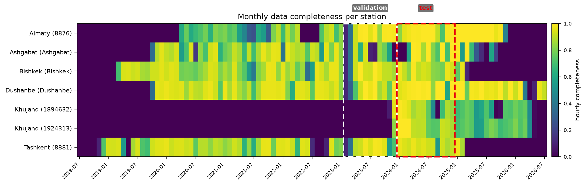
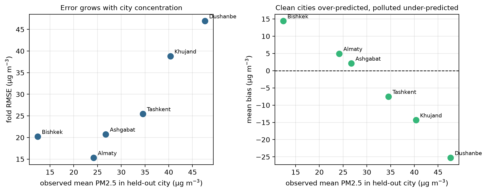

# A quality-controlled PM2.5 dataset with frozen cross-city evaluation splits for six Central Asian cities

**Jaloliddin Musayev**<sup>1,\*</sup>, **Asadbek Abdivayitov**<sup>2</sup>,
**Ozodbek Yo'ldashev**<sup>3</sup>

<sup>1</sup> International House Tashkent Academic Lyceum, Tashkent, Uzbekistan
<sup>2</sup> First Specialized Boarding School, Karshi, Uzbekistan
<sup>3</sup> National University of Uzbekistan, Tashkent, Uzbekistan

<sup>\*</sup> Corresponding author: jaloliddin2009applicant@gmail.com

ORCID iDs: Jaloliddin Musayev 0009-0003-0210-3687; Asadbek Abdivayitov 0009-0006-3484-3438.

---

## Abstract

We present a quality-controlled dataset of daily PM2.5 observations from 7
instruments in 6 Central Asian cities — Almaty, Ashgabat, Bishkek, Dushanbe,
Khujand and Tashkent — covering 2018-11-27 to 2024-12-31. Records were screened by seven
pre-registered quality rules, plus one added after validation exposed a duplicated
instrument, then deduplicated and timezone-verified; 5 are US
embassy reference monitors and 2 low-cost sensors, labelled as such.
Each station-day is paired with satellite retrievals, chemistry-transport forecasts,
reanalysis meteorology and static geography, each predictor carrying a measured acquisition
latency fixing whether it could be known at prediction time. The release includes frozen, checksummed splits
(blocked-temporal with a 240-hour purge; leave-city-out over 6
folds), a baseline ladder and reference model outputs. Held-out-city bias falls monotonically with the city's mean
concentration (Spearman rho = -1.00), a regression toward training levels; fold
RMSE rises with it but not after normalising by each city's variability
(rho = -0.03). The data support cross-city generalisation,
satellite-ground fusion, sensor comparison and reproducible benchmarking.


## Background and Summary

Central Asia is among the most polluted inhabited regions on earth, and among the least
instrumented. Tursumbayeva et al. (2023) put annual PM2.5 in six regional capitals at 4.3–12.6
times the WHO 2021 guideline, tracing the burden mainly to coal combustion rather than
transport, against official emissions inventories. Source-apportionment studies reach the same
conclusion independently in Kazakhstan (Tursun et al., 2025) and Tajikistan (Papagiannis et
al., 2024). The monitoring base beneath those numbers is thin and unevenly
open: Turkmenistan operates no national network, Kazakhstan releases data only to users
physically inside the country, and only Kyrgyzstan publishes in a fully open form
(OpenAQ, 2025).

Estimates are not what the region lacks. Global gridded products
(van Donkelaar et al., 2021) already assign PM2.5 values
across Central Asia, and the epidemiological literature consumes them. What nobody can do is
check those estimates, or set two methods against each other on identical terms. There is no
open station-level benchmark for the region — no frozen splits, no declared protocol, no
shared evaluation.

The cost of that absence is measurable. Consider the closest analogue: PM2.5 estimation across
Xinjiang, an arid, dust-affected, sparsely monitored region much like this one. Jin et al.
(2022) report R² between 0.73 and 0.81 under 10-fold cross-validation with no spatial
stratification. With 41 stations in 16 cities and 8-day averaging, that design places
observations from the same station, often the same window, on both sides of the split. Such a
figure measures interpolation among stations already held rather than estimation where no
monitor exists, and nothing in a reported R² separates the two. The remedy is established:
blocked validation for spatially, temporally or hierarchically structured data (Roberts et
al., 2016), for spatially derived predictors (Meyer et al., 2019) and for particulate data
specifically (Alazmi and Rakha, 2022), with validation strategy named among the systematically
overlooked issues in the field (Tang et al., 2024). What the region has never had is a
benchmark that enforces it.

AQ-Bench (Betancourt et al., 2021) is the precedent — 5,577 stations worldwide, split by
spatial clustering at a 50 km threshold — but it targets long-term ozone metrics from station
metadata in a time-independent regression, and excludes Central Asia entirely. We borrow its
spatial clustering rationale rather than inventing a second one, and diverge on pollutant,
target, temporal protocol and region. AirDelhi (Chauhan et al., 2023) offers a second
precedent for fine-grained particulate benchmarking, confined to a single city.

This paper documents a benchmark of 7 instruments across
6 cities spanning 2018-11-27 to 2024-12-31. Splits were frozen and hashed
before the reported results were produced: blocked-temporal with a purge gap of
240 hours from the maximum feature lag (168 h) and horizon
(72 h), leave-city-out over 6 folds, and leave-station-out
where station density allows (2 folds; Almaty, Ashgabat, Bishkek, Dushanbe, Tashkent hold one instrument
each and are named ineligible rather than quietly dropped). Immutability is enforced by a
test that fails for the authors exactly as for anyone else. Every predictor carries a measured
latency and a typed availability flag, so anything that cannot exist at prediction time is
barred from deployable configurations by test rather than convention.

One fold deserves naming. Khujand's stations begin after the training block closes, so the
city contributes no training label anywhere in the record — not one row. A model arrives with
no local history and must return a concentration regardless. This is the harshest test the
benchmark contains, and the one that matches the deployment case the work exists for: an
unmonitored city asking for a number it has never been given. We report it separately;
averaging it into the other five would report neither.

The intended reuse is direct. Any method producing a PM2.5 estimate, statistical, physical or
learned, can be scored on these splits against the included baseline ladder without
re-deriving a protocol, and without the ambiguity that makes existing regional figures
incommensurable.


## Methods

### Study region and period

The benchmark covers 6 Central Asian cities — Almaty, Ashgabat, Bishkek, Dushanbe,
Khujand and Tashkent — over 2018-11-27 to 2024-12-31. Cities were not selected: they
are every city in the region with an openly published PM2.5 record meeting the inclusion rules
below. Turkmenistan operates no national network, and Kazakhstan releases national-network
data only to users physically inside the country, so both are represented solely by US
diplomatic-post monitors.

### Ground observations

Hourly PM2.5 was retrieved from the OpenAQ v3 archive for all stations within the region's
bounding box. 317 candidate stations were assessed. Inclusion required, as pre-registered
before the data were inspected:

**These are preliminary data.** The reference-grade observations originate with the US EPA
AirNow programme, which states that its observational data "are not fully verified or
validated" and "should be considered preliminary", and that they "are not subjected to the
full validation used to officially submit and certify data in EPA's regulatory database".
Fully validated regulatory data are held in EPA's Air Quality System and were not used here.
The quality-control suite below is therefore applied to preliminary data and does not
substitute for the originating agencies' validation. Any result computed on this benchmark
inherits that status.

- **Q7 span and completeness** — at least 2 years of record and
  60% completeness within it. This is the rule that excludes 306
  stations, almost all low-cost units, and that excludes Astana at
  42.8% completeness.
- **Q1 physical range** — values outside [0, 1000] µg/m³ are masked.
- **Q2 flatlining** — ≥24 consecutive identical non-zero values are masked.
- **Q3 zero runs** — ≥6 consecutive zeros are masked.
- **Q4 unit sanity** — station median outside [1, 500] µg/m³ rejects the series, catching
  mg/m³ reported as µg/m³ and AQI values reported as concentrations.

Every rule records its effect on *n* and its direction of bias if wrong; the full decision log
is `data/DECISIONS.md`.

**Duplicate resolution (Q5).** Two distinct failures are handled separately. *Q5a*: one
identifier appearing at more than one coordinate rejects the series. *Q5b*: several
identifiers within 150 m are one instrument, detected by single-link clustering over the
haversine distance, and merged. *Q5c*: any pair whose overlapping observations are
bit-identical on more than half of samples is one instrument regardless of separation. Q5c was
added after Q5b passed a pair 6.06 km apart that proved to be a single US-embassy monitor
republished under two programmes; the evidence is given in Technical Validation.

Merging is by **precedence and gap-fill, never averaging**: the feed with more observations is
primary, the other fills only the hours the primary lacks, and per-hour provenance is retained
in `panel_sources.parquet`. Averaging two copies of one measurement reduces no noise and, where
the copies disagree, fabricates a third value no device produced. Three pairs merge under this
rule — Bishkek, Ashgabat and Dushanbe — giving 7 instruments across
6 cities.

**Q6 timezone verification.** Metadata offsets are not trusted. Each station's diurnal
composite is cross-correlated against a regional reference, and the check reports lag
identifiability rather than asserting a shift: Central Asian urban PM2.5 is bimodal with peaks
roughly half a day apart, so whole-shape correlation cannot separate a 12-hour offset from
none. Where the hypothesis is not distinguishable the station is flagged, not rejected.

**Daily target.** The prediction target is the local-calendar daily mean, requiring at least 18
hourly observations. Local days rather than UTC: a UTC boundary splits a Central Asian night in
half, cutting the overnight inversion peak across two days and understating both.

### Predictor sources

Each predictor carries a **measured** acquisition latency and a typed availability flag, so
that anything which cannot exist at prediction time is excluded from deployable configurations
by test rather than by convention. Latency was measured rather than assumed; three of five
initial estimates proved wrong, one by 774 days.

- **Satellite.** Sentinel-5P CO, NO₂, SO₂ and absorbing aerosol index (Veefkind et al.,
  2012); MODIS MAIAC AOD (Lyapustin et al., 2018).
  Retrieval-quality fractions are carried as features, because missingness in these products is
  correlated with the target — SO₂ retrieves on 0.1% of December days against 92.6% in summer,
  a solar-geometry floor that blinds the direct winter coal tracer throughout the coal season.
  Null rows are retained rather than imputed: interpolating across a systematically missing
  extreme tail would invent the values that matter most.
- **Chemistry transport.** Copernicus CAMS global PM2.5 forecast, used both as a feature and,
  bias-corrected, as a baseline.
- **Reanalysis meteorology.** ERA5 single-level fields (Hersbach et al., 2020).
- **Static geography.** Elevation, terrain basin indices at multiple radii, VIIRS night-time
  lights, and population density.

### Split construction

Splits were built by `src/ecopulse_ca/splits/builder.py`, hashed, and committed. They are
immutable by test: `splits.sha256` is compared against a fresh build on every run, and the
test fails for the authors exactly as for anyone else. Changing a split requires raising the
benchmark version, recording the reason in `data/DECISIONS.md`, and regenerating every
published number — deliberately more work than editing a JSON file.

**Temporal blocks.** Train, a purge, validation, a second purge, test, and a reserved
post-test block. The test block is calendar 2024, the last full year of reference
coverage in the frozen panel: every StateAir feed stops on 2025-03-04, when that publication
channel closed. Each purge is
240 hours, derived rather than chosen:
`purge_hours = max_lag_hours (168) + max_horizon_hours
(72)`, so that no training row's feature window can reach into the block
that follows. The relation is stated in `config.purge_rule` so a reader can verify it.

**What that bound covers, precisely.** `max_lag_hours` bounds the features admitted under
leave-city-out, which is the protocol every headline number in this paper is computed under.
Task F additionally admits a station's own history, including a 30-day rolling mean whose
window reaches 720 h and therefore crosses the purge into the preceding block. That is
deliberate and it is not leakage in the leave-city-out sense: a forecaster at a monitored
station genuinely holds that station's past observations at prediction time. It does mean a
Task F test row's own-history features can overlap the validation block used for tuning, so
Task F figures carry a weaker separation guarantee than Task N figures and the two are never
compared. A submission that uses an own-history window longer than 168 h under
Task N would violate the protocol; two tests in `tests/test_purge_gap.py` pin the exclusion
and the declared window length so neither can drift unnoticed.

**Leave-city-out** (6 folds). Each fold withholds one city entirely — every
station in it, for the whole record. This is the protocol the benchmark is built around,
because it is the only one that answers the deployment question: what is the concentration at
a location with no local monitor?

Spatial blocking is contested, and the objection applies to a different estimand than this
one. Wadoux et al. (2021) show that spatially blocked cross-validation is pessimistically
biased for *map accuracy* over a fixed population, where design-based validation on a
probability sample is the correct estimator. The quantity here is not map accuracy; it is the
error incurred in a city that contributed no training row. For that, withholding the city is
the estimand rather than a biased proxy for it, and a random split estimates something else.
Meyer and Pebesma (2021) give the complementary frame: whether a held-out city falls inside
the model's area of applicability. Technical Validation answers that question empirically: held-out-city bias falls
monotonically with the city's mean concentration (Spearman rho = -1.00), while
fold RMSE carries no such relation after normalisation by each city's own variability
(rho = -0.03).

**Leave-station-out** (2 folds). Available only where a city holds more than one
instrument. Almaty, Ashgabat, Bishkek, Dushanbe, Tashkent hold one instrument each and are named ineligible rather than
quietly dropped.

**Both remaining folds are the Khujand pair, and both of those instruments are low-cost
sensors.** Merging the two co-published Dushanbe records into one instrument (see above)
removed the only reference-grade city holding more than one device, so within-city station
holdout is now evaluated *exclusively* on the Clarity pair. This protocol therefore says
nothing about generalisation across the reference-monitor network, and it supports no headline
claim in this paper. Leave-one-out protocols carry a documented failure mode of their own
(Austin et al., 2025), which is a further reason not to rest a headline number on two folds.
The folds are retained because they are well defined and may be useful to a method
specifically targeting low-cost sensor transfer.

### Reference implementation

Three feature tiers are defined by availability at prediction time — `static_only`,
`deployable` and `retrospective` — so that a retrospective number can never be mistaken for a
deployment claim.

Two tasks are defined separately and never pooled. **Task N** (nowcasting at unmonitored sites)
withholds whole cities and admits no local history. **Task F** (forecasting at monitored
stations) permits the station's own lagged observations; as implemented here it predicts the
next-day daily mean from lags of 1, 2 and 7 days plus 7- and 30-day rolling means, and is
therefore single-horizon.

The reference model is LightGBM. Hyperparameters are selected by grid search over
16 combinations on the validation block only; a test parses the tuning
function and fails if it references the test block at all. The selected configuration is then
refit on train plus validation, with the purge block withheld, and scored once on the test
block per configuration. Every configuration runs 5 seeds (0, 1, 2, 3, 4) and is
reported as mean ± standard deviation.

**Baselines.** A mandatory ladder that every submission must climb: persistence, climatology,
a training-pool constant, nearest-monitor, inverse-distance weighting, ordinary kriging, and
CAMS in three variants. The CAMS bias correction is fitted on the training block only; the
pooled variant excludes the held-out city from its own correction, so no label from a city
informs its own reference. Baselines are additionally scored at daily resolution on the models'
own evaluation rows, because an hourly RMSE is not comparable to a daily one.

### Statistical methods

Model-versus-baseline comparison uses the Diebold–Mariano test on squared-error differentials
with Newey–West HAC variance and the Harvey–Leybourne–Newbold small-sample correction. Because
the loss differential is serially correlated within station and station-days cluster within
cities, a pooled station-day test is not a valid inference; the primary analysis aggregates to
one value per city and tests those 6 observations, with sensitivity analyses across
HAC truncation lags and a cluster bootstrap. With 6 clusters an exact sign-flip
permutation test is reported alongside the parametric one, and its attainable floor is stated.
Per-fold tests are Holm-corrected for multiplicity (Holm, 1979), and are read as
descriptive diagnostics rather than as the inferential claim, since both comparators are
estimated models rather than given forecasts (Diebold, 2015). Full detail and results are in Technical
Validation.

### Software and generative-AI assistance

Analysis code is Python 3.12; exact dependencies and versions are given in Code Availability.
A generative AI assistant (Anthropic Claude, via Claude Code) was used during this work for
software implementation, data-pipeline construction, statistical tooling, and drafting and
editing of manuscript text. This is not AI-assisted copy editing, so it is declared rather
than exempt. The methodological decisions the dataset rests on — the pre-registration of the
quality rules, the choice to freeze and checksum the splits before any model was run, the
leave-city-out protocol, the treatment of informative missingness, and every retraction
recorded in `data/DECISIONS.md` — were made by the authors, who verified every reported figure
against the regenerated result tables and take full responsibility for the content. See
*Use of Generative AI* for the full declaration.


## Data Records

The benchmark is deposited as a single versioned archive, **`eco-pulse-ca` v1.1.0**.
Every file below is plain text (JSON or CSV) and carries a SHA-256 digest in
`splits.sha256`, which the test suite verifies on every run.


**Figure 1.** The 7 benchmark instruments across 6 Central Asian
cities. Marker style distinguishes the 5 US diplomatic-post
reference monitors from the 2 Clarity low-cost sensors at Khujand.
Leave-city-out withholds every instrument in one city at a time, so the spacing between
cities — not between instruments — sets the extrapolation distance each fold demands.



**Figure 2.** Monthly hourly-completeness for each of the 7 benchmark stations,
from first to last observation. Dashed boxes mark the validation (2023-01-11 to
2023-12-21) and test (2024-01-01 to 2024-12-31) blocks. Two features of the record are
visible directly: both Khujand sensors begin only in late 2023, after the training block
closes, which is what makes Khujand a zero-label fold; and the record ends unevenly, with
2 of 7 stations
(8881, Bishkek) stopping at the StateAir closure on 2025-03-04 while the
remainder continue past it through a longer-lived feed. All of that lies beyond the test
block and none of it is used.

### The frozen benchmark definition

These five files *are* the benchmark. A method is evaluated on this benchmark by consuming
them; nothing else in the archive is required.

| File | Format | Size | Contents |
|---|---|---:|---|
| `splits.json` | JSON | 4,994 B | The complete benchmark definition: version, station table, temporal blocks, leave-city-out folds, leave-station-out folds, and the protocol configuration. Self-contained. |
| `temporal_blocks.json` | JSON | 725 B | Train, purge, validation, purge, test and reserved blocks with UTC bounds. |
| `leave_city_out.json` | JSON | 1,771 B | The 6 spatial folds, each naming held-out city, held-out stations and training stations. |
| `leave_station_out.json` | JSON | 493 B | The 2 within-city folds, plus the cities named ineligible and why. |
| `splits.sha256` | text | 333 B | SHA-256 of each file above, with the freeze timestamp. |

**`splits.json` — record structure.**

*`stations`* (7 records). One per instrument: `station_id`, `city`, `latitude`,
`longitude`, `n_observations`. Station identifiers are OpenAQ `location_id` values as strings,
except where two co-published feeds were merged into one physical instrument, in which case
the identifier is the city name (see Methods, and `panel_sources.parquet` for per-hour
provenance of the merge).

*`temporal_blocks`* (6 records). `name`, `start`, `end`, in UTC. The two `purge_*` blocks are
excluded from training and evaluation by construction and exist to break autocorrelation
across the boundary.

*`leave_city_out`* (6 records). `fold`, `held_out_city`, `held_out_stations`,
`train_stations`, `n_train_cities`.

*`leave_station_out`* (2 records plus an `ineligible_cities` list).
`fold`, `city`, `held_out_station`, `train_stations`.

*`config`*. `max_lag_hours` = 168, `max_horizon_hours` = 72,
`purge_hours` = 240, `test_year` = 2024, `seeds` =
0, 1, 2, 3, 4, and `purge_rule`, which states the arithmetic relation the purge must satisfy
so that a reader can verify it rather than trust it.

### Reference results

Provided so that a new method can be placed on the same axes without re-running the
reference implementation. All are CSV with a header row.

| File | Rows | Contents |
|---|---:|---|
| `t3_01_task_f_baselines_hourly.csv` | 60 | Task F baseline ladder, hourly, by station and horizon. |
| `t3_02_task_n_baselines_hourly.csv` | 28 | Task N baseline ladder, hourly, by station, with exceedance metrics. |
| `t3_06_task_n_baselines_daily.csv` | 49 | **Task N baseline ladder at daily resolution**, scored on the same evaluation rows as the learned models. This is the table to compare a daily model against; the hourly tables are not comparable to it. |
| `t4_01_cams_baseline_variants.csv` | 21 | CAMS raw, locally debiased and pooled-debiased, per station. |
| `t5_01_loco_untuned.csv` | 108 | Untuned gradient boosting, leave-city-out, per fold and seed. |
| `t5_02_loco_tuned.csv` | 123 | Tuned gradient boosting, leave-city-out, per fold and seed, with selected hyperparameters. |
| `t6_01_predictions_task_n.csv` | 2,214 | **Row-level predictions** on the test block: `station_id`, `date`, observed `pm25`, ensemble `lgbm`, per-seed `lgbm_seed0`–`lgbm_seed4`, `pooled` (debiased CAMS), `fold`. |
| `t6_02_dm_lgbm_vs_cams.csv` | 7 | Diebold–Mariano per fold and pooled. |
| `t6_06_significance.csv` | 7 | Primary and sensitivity inference with unit of analysis, statistic, *p* and confidence interval. |
| `t6_07_per_fold_holm.csv` | 6 | Per-fold *p*-values with Holm step-down correction. |
| `t7_06_leave_khujand_out.csv` | 2 | **Leave-Khujand-out sensitivity.** The primary inference recomputed over the five reference-grade cities, with each arm's city count, row count, RMSEs, mean loss differential, both *p*-values, the attainable permutation floor and a rule-assigned verdict. |

`t6_01_predictions_task_n.csv` is the most reusable record: it permits any alternative loss,
significance procedure or aggregation to be applied to the reference implementation without
retraining it, and its per-seed columns make the ensemble decomposable.

### What is not redistributed, and why

**The derived ground-truth panel is not included.** It is built from the OpenAQ archive,
whose per-feed licence terms are heterogeneous: six of the ten source feeds carry an explicit
licence permitting redistribution and four carry no licence record at all. Depositing the
merged panel under a single licence would assert a uniform permission the evidence does not
support for every feed. The full matrix, retrieved 2026-08-14, is in `data/MANIFEST.md` and
summarised in Data Availability. `data/MANIFEST.md`
records the full provenance of every source, and two documented commands rebuild the panel
from the archive with an API key.

This is a real limitation of the deposit and is stated rather than worked around: the split
definitions and reference results are fully self-contained and verifiable offline, but
*regenerating* the reference results from raw observations requires that acquisition step.


## Technical Validation

Validation is reported in three layers: the quality control applied to the observations, the
integrity of the split definitions, and the behaviour of a reference implementation evaluated
under the protocol. The third layer is included because a benchmark whose reference
implementation has never been run is not validated — but its results are presented as
evidence about the *task*, not as a claim of method performance.

### Observation quality control

Seven rules (Q1–Q7) were declared in `data/DECISIONS.md` **before the data were inspected**,
each recording its effect on *n* and the direction of bias if the rule is wrong. Two produced
findings that changed the benchmark. **One further rule, Q5c, was not pre-registered**: it was
added during validation, after the pre-registered rules had passed a station pair that
inspection showed to be a single instrument. That sequence is described below rather than
presented as foresight.

**Duplicate identity — and the case a distance rule cannot see.** The US embassy monitors are
published twice, by StateAir and by AirNow, under separate identifiers. Where the two records
agree on position (Bishkek, 57 m; Ashgabat, 40 m) a 150 m co-location rule catches them.
Where they disagree it does not. Dushanbe's two records sit **6.06 km apart** and were
initially treated as distinct sites — the manuscript even cited that separation as evidence
they were distinct.

They are not. Over the 33,462 hours in which both report,
**94.0% of readings are bit-identical**, and of the remainder
99.9% match exactly at a five-hour offset — Dushanbe is UTC+5, so those are
the same measurements timestamped in local time rather than UTC. Taken together
**99.99% of overlapping hours are the same reading**. The comparable
Khujand pair, 14.4 km apart, is bit-identical on 0.3% of hours.

A value-identity rule (Q5c) was therefore added: flag any station pair whose overlapping
observations are bit-identical on more than half of samples, regardless of separation. Two
independent instruments do not agree to floating point. The threshold sits in the middle of
a measured 36× gap between coincidence (2.6% for unrelated station
pairs, an artefact of hourly values being reported as rounded integers) and duplication.

The Dushanbe records are merged under the same precedence-and-gap-fill rule already applied to
Bishkek and Ashgabat — never averaging, because averaging two copies of one measurement
reduces no noise and fabricates a third value where they differ. The benchmark holds
**7 instruments across 6 cities**, and the version was raised to
1.1.0 to mark that the splits changed.

**Timezone correctness.** Metadata offsets are not trusted; each station's diurnal composite
is cross-correlated against a regional reference. An initial implementation rejected both
Khujand sensors for an apparent 12-hour shift, which investigation showed to be an artefact:
the regional reference self-correlates at r = +0.71 under a 12-hour rotation, because Central
Asian urban PM2.5 is bimodal with peaks roughly half a day apart. The check now reports lag
identifiability and flags rather than rejects when the hypothesis cannot be distinguished.

A limitation of this check must be stated. It compares stations against city peers, and only
Khujand holds more than one instrument. **A constant, lifelong
offset at a single-instrument city is undetectable by any check in this suite.**

### Instrument grade

5 of 7 instruments are US diplomatic-post monitors
published by AirNow or StateAir (`is_monitor = true` in the OpenAQ census). These are
BAM/FEM-class beta-attenuation instruments operated under the programme's documented QA
regime, and they are the region's only consistent multi-country reference.
**The 2 Khujand instruments are Clarity Node-S low-cost optical
sensors** (`is_monitor = false`), which use light scattering rather than gravimetric-equivalent
measurement and carry the humidity- and composition-dependent uncertainty documented for that
class (Zheng et al., 2018). This matters more than a metadata note, because
Khujand is the benchmark's zero-label fold: the city contributes no training row anywhere in
the record, making it the harshest spatial test the benchmark contains *and* the one city
whose labels carry low-cost measurement uncertainty (Zheng et al., 2018).

Both Khujand instruments also satisfy the pre-registered 2-year span rule only
by counting observations after the benchmark record ends; inside the window their spans are
1.09 y and 1.07 y. Admitting them was a
coverage decision, and it is recorded as one.

### Split integrity

- **Immutability.** `splits.sha256` is compared against a fresh build on every test run. The
  test fails for the authors exactly as it fails for anyone else; changing a split requires
  raising the version, recording the reason, and regenerating every published number.
- **Purge sufficiency.** `purge_hours` = 240 = `max_lag_hours`
  (168) + `max_horizon_hours` (72), verified arithmetically
  at both boundaries so that no training row's feature window reaches into the evaluation
  block.
- **Fold disjointness.** Automated assertions verify that no leave-city-out fold trains on any
  station in its held-out city, that no leave-station-out fold trains on its held-out station,
  that every evaluated row falls inside the test block, and that each fold evaluates only its
  own city.
- **Tuning isolation.** Hyperparameters are selected on the validation block; a test parses
  the tuning function and fails if it references the test block at all.
- **Baseline isolation.** The CAMS bias correction is fitted on the training block only, and
  the pooled variant excludes the held-out city from its own correction — otherwise the
  reference every model is measured against would itself contain test information.

### Reference implementation behaviour

Scored at a single temporal resolution on the frozen test block, over 5 seeds:

| Model (leave-city-out, daily) | RMSE µg/m³ |
|---|---:|
| nearest_monitor | 33.50 |
| training_pool_mean | 32.75 |
| train_global_mean | 32.70 |
| train_global_median | 30.99 |
| ordinary_kriging | 29.75 |
| idw_k5_p2 | 29.44 |
| **LightGBM, retrospective (log target)** | **28.01** |

**The tuned reference model leads every admissible baseline, and explains little within-city
variation.** It scores 28.01 ± 0.35 µg/m³
against 29.44 µg/m³ for the strongest legal rung
(`idw_k5_p2`), ahead of all 6 of them **on the fold mean**.
That ordering is not robust: the paired difference over 6 cities is not
statistically separable (*p* = 0.586), per-fold differences span −10.73 to
+5.10 µg/m³, and removing one city reverses the lead in one of 6 subsets. The
margin is 4.1× the seed standard deviation, so it is fold heterogeneity
rather than run-to-run noise (`t7_05_ranking_robustness.csv`). A constant equal to
the held-out city's own test-block mean scores 28.12 µg/m³, but that
predictor uses test labels and is **not legal** under leave-city-out; it is reported as a
diagnostic floor only. Mean per-fold R² is
-0.04, with a spread of -0.55 to 0.52 and
3 of 6 folds negative. Pooled against the global mean,
R² = 0.13. The model captures some between-city variation and within-city
skill that does not generalise across cities: per-fold R² is positive in
3 of 6 cities and negative in the rest. A reader given
only the pooled figure would substantially overestimate what it does.

Baselines are scored at the same daily resolution on the same evaluation rows; an hourly
RMSE is structurally larger than a daily one and the two are never compared.

### Where the data are hard



**Figure 3.** Leave-city-out error against the held-out city's mean PM2.5. Left: fold RMSE
rises with city concentration (Spearman rho = 0.94). Right: mean bias falls
monotonically from 14.4 µg/m³ in Bishkek, the cleanest city, to
-25.3 µg/m³ in Dushanbe, the most polluted
(rho = -1.00).

The two panels are not equally strong evidence, and the difference matters for reuse. RMSE
scales with the variability of whatever is being predicted, so the left panel is partly a
scale effect: dividing each fold's RMSE by that city's own observed standard deviation leaves
no monotone relation with concentration at all (rho = -0.03). The bias
panel does not have that weakness. It is monotone across every fold without exception
(rho = -1.00), and it identifies the mechanism: a model trained on five cities
and applied to a sixth predicts toward the concentrations it was trained on, over-predicting
cleaner cities and under-predicting more polluted ones. The
same pattern holds within the concentration range: bias is 10.1 µg/m³ on days
below the WHO 24-hour guideline and -90.4 µg/m³ above six times it, where RMSE
reaches 100.9 µg/m³ on the 6.6% of rows in that band. Winter
(DJF) RMSE is 51.0 µg/m³ against 16.0 µg/m³ in summer.

This is a property of the region and the network rather than of one model, and it is the
clearest thing the dataset shows: **transferring a PM2.5 model to an unmonitored Central Asian
city fails first on the city's overall level, not on its day-to-day pattern.** Per-fold,
per-band and per-season figures are in `t7_01`–`t7_03`.

### Statistical validation

The comparison against bias-corrected CAMS is reported under a primary analysis declared on
scientific grounds, with sensitivity analyses, rather than by selecting a favourable test.

The estimand is the reduction in squared error **at a city with no local training labels**, so
the unit of generalisation is the city. Aggregating to one value per city gives
6 observations.

The quantity tested is the loss differential Δ, the model's squared error minus debiased
CAMS's, in (µg/m³)². Negative values favour the model.

| | Test | Unit | *n* | Δ (95% CI) | *p* |
|---|---|---|---:|---:|---:|
| **Primary** | paired *t* on city means | city | 6 | **-96.2 (-237.0, +44.5)** | **0.1392** |
| **Primary** | exact sign-flip permutation | city | 6 | **-96.2** | **0.1250** |
| Sensitivity | station-day, independence assumed | station-day | 2214 | -101.7 (-133.3, -70.2) | 2.6e-10 |
| Sensitivity | station-day, Newey–West HAC (lag 60 d) | station-day | 2214 | -101.7 (-171.7, -31.7) | 0.0044 |
| Sensitivity | cluster bootstrap over cities | city | 6 | -96.2 (-196.5, -2.9) | 0.0428 |

**The interval is the more informative half of the primary row.** At
(-237.0, +44.5) (µg/m³)² it spans zero and is wide enough to contain both a substantial
improvement over CAMS and a moderate degradation. The study does not establish that the model
is better, and it equally does not establish that it is not: with 6 cities the
design cannot separate those cases. Reporting only *p* = 0.1392 would invite the
reading that no effect exists, which the interval does not support either.

The loss differential is serially correlated within station (first-order autocorrelation
0.25), so the independence-assuming figure is reported only for comparison with
earlier drafts and is not a valid inference. With 6 clusters, cluster-robust
asymptotics are also unreliable — the variance estimator is materially downward-biased below
roughly 30–50 clusters (Cameron and Miller, 2015) — which is why an exact permutation test is
reported alongside. Its smallest attainable two-sided *p*-value is 0.03125, a floor
imposed by having only 6 cities, stated so that it is not mistaken for evidence.

Per-fold Diebold–Mariano tests are additionally Holm-corrected (Holm, 1979) for
6 comparisons, the family being the per-fold comparisons of one model pair;
**3 of 6 survive at α = 0.05.**

**The evidence does not support a claim that the reference model outperforms bias-corrected
CAMS under the unit of generalisation this benchmark is built around.** That is reported as
the result.

### Evaluation protocol, and a disclosure

The test block was scored under **two** frozen configurations. Both selections were made on
the validation block; neither used test performance as a criterion. The history is given in
full so a reader can judge it rather than take it on trust.

**Freeze 1 — target transform.** Daily PM2.5 in this record has skew 2.79 and excess kurtosis
13.5, so squared error on the raw scale is dominated by a few extreme days. Four formulations
(raw, log1p, and residual-against-interpolator variants of each) were compared across three
model families on validation only. `log1p` won for every family. Frozen, then scored once on
test: fold-mean RMSE fell from 30.24 to 28.05 µg/m³.

**Freeze 2 — feature exclusion.** A validation ablation indicated that satellite
retrieval-count features harmed leave-city-out generalisation, which is mechanistically
plausible: retrieval success depends on local surface brightness, snow cover and solar
geometry, all city-specific. Frozen, then scored once on test: **the validation gain of
1.75 µg/m³ did not replicate, delivering 0.045 µg/m³.**

**That non-replication is reported rather than removed.** Reverting the configuration after
seeing its test result would have made the test set a selection criterion, which is the
practice the frozen protocol exists to prevent. The exclusion therefore stands, and the
finding — that validation-based feature selection over six cities does not reliably transfer —
is itself information for anyone reusing these splits.

No city, station, date or evaluation period was excluded at any point on the basis of its
effect on a score. `scripts/experiment_model_search.py` and
`scripts/experiment_ablation_ensemble.py` never read the test block, which is enforced by
`tests/test_frozen_configuration.py`.

### Reproducibility

A single command regenerates every reported number from the frozen splits. Two consecutive
runs reproduce all 30 result tables **byte-identically**, verified by
SHA-256. The manuscript is rendered from templates whose numeric fields are substituted from
a machine-extracted mapping, so no reported figure is typed by hand, and a test re-extracts
from the CSVs and fails if any figure has drifted.

The reference implementation is deterministic: Section 5's per-seed RMSEs and Section 6's
per-seed predictions agree to floating point across all
6×5 fold-seed pairs, and the ensemble satisfies the convexity bound
relating it to its members in every fold.


## Usage Notes

### How to score a method on this benchmark

1. Read `splits.json`. It is self-contained: station table, temporal blocks, and both fold
   definitions.
2. Fit only on the rows a fold permits. For leave-city-out, no observation from the held-out
   city may enter training — including indirectly, through a neighbour feature or a bias
   correction estimated on that city.
3. Predict on the test block (2024-01-01 to 2024-12-31) and score against the daily
   target: local-calendar daily mean PM2.5, requiring at least 18 hours of observations.
4. Report **per city, not pooled**, with dispersion across at least the
   0, 1, 2, 3, 4 seeds.
5. Compare against `t3_06_task_n_baselines_daily.csv`, which is scored on the same rows at
   the same resolution.

### Six rules the benchmark asks of every submission

These are the reporting conditions under which numbers from different methods remain
comparable. They are applied to the reference implementation in this paper as well.

1. **State the task.** Task N (nowcasting at unmonitored sites) and Task F (forecasting at
   monitored stations) are different problems with different admissible features. Never pool
   them, and never quote a Task F number as a general accuracy.
2. **State the tier.** `static_only`, `deployable` and `retrospective` differ in whether a
   predictor could exist at prediction time. A retrospective number is not a deployment claim.
3. **Report per city.** A pooled figure over 6 cities of unequal size hides which
   cities fail.
4. **State the truncation lag** used in any Diebold–Mariano test, and report a sensitivity
   sweep. A verdict that flips with the lag choice is not a verdict.
5. **Report seed dispersion.** At least mean and standard deviation over the declared seeds.
6. **State the unit of analysis** for any significance claim, and justify it. Station-days are
   not independent observations.

### Pitfalls this benchmark is designed to expose

**Temporal resolution is not a free choice.** RMSE computed on hourly observations is
structurally larger than RMSE on daily means of the same data, because averaging removes
within-day variance. An hourly baseline placed beside a daily model produces an apparent
margin that is arithmetic, not skill. This paper made that error and corrected it; the daily
ladder exists so that the comparison is unambiguous.

**Two aggregations of R² answer different questions.** Mean per-fold R², computed against each
city's own mean, measures within-city day-to-day skill. Pooled R² against the global mean
largely measures whether cities differ from each other, which is far easier. Report which one
you mean. On this benchmark the reference model scores -0.04 on the first
and 0.13 on the second.

**Exceedance F1 has a high floor.** 4 of the 6 cities
clear the WHO 24-hour guideline on most days, from 88% of test days at
Dushanbe down to 24% at Bishkek,
so a classifier that always predicts "exceeds" scores F1 = 0.741 at a base rate of
61.8%. Peirce skill score is reported alongside because it is zero for that
classifier by construction.

**A single station can move the conclusions.** Merging one duplicated instrument changed every
fold's RMSE and reversed the ordering of feature-attribution families. Attribution rankings on
a 7-instrument benchmark should be treated as unstable, and this paper's own
earlier claim about them is retracted in Technical Validation.

**One city carries 26.7% of the pooled rows.** Khujand is the only
two-station city, so any row-level statistic here is weighted toward it, and it is also the
only city with low-cost labels. `t7_06_leave_khujand_out.csv` recomputes the primary
inference without it: the verdict is unchanged (ROBUST), with paired *t*
*p* = 0.1392 over all 6 cities against 0.2165 over the five
reference-grade ones. Report per city, and if you must pool, run the same exclusion.

### Known limitations

- **Six cities.** The spatial sample is small, and it bounds every inference: with
  6 clusters, no significance procedure can attain a two-sided *p* below
  0.03125 without distributional assumptions the data do not support.
- **Two of 7 instruments are low-cost**, and they constitute the zero-label
  Khujand fold. Results for that fold are not comparable in kind to the other five.
- **Single-instrument cities cannot be timing-audited.** Only Khujand holds two genuinely
  distinct instruments, so a constant lifelong offset at Almaty, Tashkent, Bishkek, Ashgabat
  or Dushanbe would be invisible to every check in the suite. Dushanbe belongs on that list
  only after the merge recorded in `DECISIONS.md` D-012, which established that its two
  records were one instrument published twice.
- **The record ends before the source does.** Every StateAir feed stops on 2025-03-04, when
  that publication channel closed, and the **evaluated** record ends with the 2024 test block.
  Observations after it exist in the panel but are reserved and unused. The monitors themselves
  did not all stop: as of 2026-08-14 the same US diplomatic-post instruments are still
  republished through AirNow at Ashgabat (to 2025-09-24), Almaty (to 2025-11-14) and Dushanbe
  (still reporting), while Bishkek, Tashkent and Astana ceased on 2025-03-04. No result here
  speaks to current conditions, but the record *can* be extended forward for the three cities
  whose AirNow feed continued — doing so would change the benchmark and requires a version
  bump, not a silent refresh.
- **Kazakhstan contributes one city.** Astana failed the completeness rule at
  42.8% against a required 60%.
- **Task F is single-horizon.** The learned Task F model predicts next-day daily means and
  does not produce the 48 h or 72 h horizons its Section 3 baselines cover; the two are not
  comparable and are not tabled together.
- **The ground-truth panel is not redistributed.** Split definitions and reference results are
  self-contained and verifiable offline. Regenerating results from raw observations requires
  rebuilding the panel from the OpenAQ archive, whose per-location records are downloadable
  anonymously from its open-data bucket on Amazon S3; the v3 API route additionally needs a
  free key.

### Intended reuse

The benchmark is designed for methods comparison, not for producing exposure estimates. Any
method that yields a PM2.5 estimate — statistical, physical or learned — can be scored on
these splits and placed against the baseline ladder without re-deriving a protocol. Because
`t6_01_predictions_task_n.csv` banks row-level and per-seed predictions, an alternative loss
function, aggregation or significance procedure can be applied to the reference implementation
without retraining it.


## Data Availability

The frozen benchmark — split definitions, checksums and reference result tables — is
deposited in Zenodo at **https://doi.org/10.5281/zenodo.21930669** under a CC BY 4.0 licence, as version
1.1.0 of `eco-pulse-ca`. The archive contents and record structure are
described in Data Records.

The identifier above is the **version** DOI, which resolves to this release specifically
rather than to the latest version. Results reported against this benchmark should cite it,
together with the `splits.sha256` checksum, so that a score is attributable to one frozen
split definition.

**What the deposit does and does not contain.** The archive holds the benchmark's *derived*
artefacts: split definitions, checksums, reference result tables, row-level predictions and
the full pipeline code. **It does not contain the underlying hourly PM2.5 observations**, and
the split definitions are not a substitute for them — they are station identifiers, fold
membership and time bounds, not measurements.

Ground PM2.5 observations are accessed through the OpenAQ archive (openaq.org) and originate
with the US Department of State AirNow and StateAir programmes and with Clarity.

**Licence status, verified 2026-08-14.** Per-location licence records were retrieved from
OpenAQ's `/v3/locations` endpoint and are tabulated in full in `data/MANIFEST.md`. Six of the
ten source feeds carry an explicit licence permitting redistribution: the four AirNow feeds
are recorded as *US Public Domain* and the two Clarity feeds as *CC0 1.0*, both with
redistribution and modification allowed and attribution not required. These six account for
63.6% of contributing observation-hours. **The four StateAir feeds (Ashgabat, Bishkek,
Dushanbe, Tashkent) carry no licence record at all** — the field is null, and the absence is
systematic: across all 33 StateAir providers, none of their 36 locations carries one. The
absence tracks the provider *label* rather than the data. OpenAQ's issue tracker documents a
single location ingested under both the AirNow and StateAir labels, alternating between them,
and that location today carries the AirNow label and a US Public Domain licence; the licence
follows the label. We therefore treat the null as unassigned metadata rather than a withheld
permission, while recording that no licence record has been issued for these four feeds.

The Department of State's archived *Data Use Statement* for its air-quality programme requires
that products relying on the data give attribution to the Department and indicate that the
data "are not fully verified or validated", and asks that the data "not be altered in any way
and be disseminated as received". Its stated scope is the Mission China programme and the
`stateair.net` portal, neither of which served these four Central Asian feeds, and the portal
that did serve them published no equivalent statement. We nonetheless attribute the
observations to the U.S. Department of State and carry the verification caveat, and we treat
the final clause as a further reason not to redistribute a merged, quality-controlled,
daily-aggregated panel. `data/MANIFEST.md` sets out the full evidence and its limits. Satellite retrievals are Sentinel-5P (CO, NO₂, SO₂, absorbing
aerosol index) and MODIS MAIAC AOD; chemistry-transport forecasts are Copernicus CAMS; and
reanalysis meteorology is ERA5. Each source, its access route, its licence status and its
measured acquisition latency are recorded in `data/MANIFEST.md`.

**Why the panel is not deposited here.** Licence terms are heterogeneous across the ten source
feeds, and for the four StateAir feeds no licence has been recorded by the platform that
serves them. Depositing the merged panel under a single licence would assert uniform
permission that the evidence does not support for every feed, so the observations are left at
source. This is a statement about provenance, not about availability.

**Every observation used here is publicly retrievable, without credentials.** All ten source
feeds — the four StateAir feeds included — are published in OpenAQ's open-data archive on
Amazon S3 (`s3://openaq-data-archive/records/csv.gz/locationid={id}/`), registered with the
AWS Registry of Open Data and downloadable anonymously; retrieval of each benchmark feed was
verified there on 2026-08-14. The same records are available through the OpenAQ v3 API with a
free key. `data/MANIFEST.md` lists every source location identifier, and two documented
commands rebuild the panel. The split definitions and reference results are fully
self-contained and verifiable without any of this.

## Code Availability

All code used to build the benchmark, run the reference implementation, produce every table
and figure, and render this manuscript is openly available at
`https://github.com/jalencik/eco-pulse-benchmark`, archived at the deposit above, under an
MIT licence.

**Environment.** Python 3.12 (pinned `>=3.12,<3.13`), with numpy, pandas, scipy,
scikit-learn, LightGBM, pyarrow and matplotlib. Exact versions are pinned in
`pyproject.toml`; `python tasks.py setup` creates the environment.

**Reproduction.** A single command runs the whole chain — lint, type check, the full test
suite, checksum verification, split regeneration, baseline ladder, model layer, table
regeneration and manuscript rendering:

```
make reproduce        # or, where make is unavailable:  python tasks.py reproduce
```

The command is deterministic: two consecutive runs reproduce all 30
result tables byte-identically under SHA-256. Verifying the frozen splits requires neither
credentials nor a rebuild (`sha256sum -c splits.sha256`), and the test suite runs offline
against committed fixtures. Regenerating the reference results additionally requires the
ground-truth panel described above.

**Custom code of note.** The quality-control rules (`src/ecopulse_ca/qc/`), split builder
(`src/ecopulse_ca/splits/`), Diebold–Mariano implementation with Harvey–Leybourne–Newbold
correction (`src/ecopulse_ca/eval/`), and the primary/sensitivity inference
(`scripts/build_significance.py`) are original to this work. 592 automated tests
enforce split immutability, absence of leakage, table provenance and manuscript-number
consistency.


## References

1. Asmaa Alazmi and Hesham Rakha (2022). *Assessing and Validating the Ability of Machine Learning to Handle Unrefined Particle Air Pollution Mobile Monitoring Data Randomly, Spatially, and Spatiotemporally*. International Journal of Environmental Research and Public Health. https://doi.org/10.3390/ijerph191610098
2. George I. Austin, Itsik Pe’er and Tal Korem (2025). *Distributional bias compromises leave-one-out cross-validation*. Science Advances. https://doi.org/10.1126/sciadv.adx6976
3. Clara Betancourt et al. (2021). *AQ-Bench: a benchmark dataset for machine learning on global air quality metrics*. Earth system science data. https://doi.org/10.5194/essd-13-3013-2021
4. A. Colin Cameron and Douglas L. Miller (2015). *A Practitioner’s Guide to Cluster-Robust Inference*. Journal of Human Resources. https://doi.org/10.3368/jhr.50.2.317
5. Sachin Chauhan et al. (2023). *AirDelhi: Fine-Grained Spatio-Temporal Particulate Matter Dataset From Delhi For ML based Modeling*. Advances in Neural Information Processing Systems 36. https://doi.org/10.52202/075280-3298
6. Francis X. Diebold (2015). *Comparing Predictive Accuracy, Twenty Years Later: A Personal Perspective on the Use and Abuse of Diebold–Mariano Tests*. Journal of Business and Economic Statistics. https://doi.org/10.1080/07350015.2014.983236
7. Hans Hersbach et al. (2020). *The ERA5 global reanalysis*. Quarterly Journal of the Royal Meteorological Society. https://doi.org/10.1002/qj.3803
8. Sture Holm (1979). *A Simple Sequentially Rejective Multiple Test Procedure*. Scandinavian Journal of Statistics. https://doi.org/10.2307/4615733
9. Alexei Lyapustin et al. (2018). *MODIS Collection 6 MAIAC algorithm*. Atmospheric measurement techniques. https://doi.org/10.5194/amt-11-5741-2018
10. Hanna Meyer et al. (2019). *Importance of spatial predictor variable selection in machine learning applications – Moving from data reproduction to spatial prediction*. Ecological Modelling. https://doi.org/10.1016/j.ecolmodel.2019.108815
11. Dié Tang, Yu Zhan and Fumo Yang (2024). *A review of machine learning for modeling air quality: Overlooked but important issues*. Atmospheric Research. https://doi.org/10.1016/j.atmosres.2024.107261
12. Kazbek Tursun et al. (2025). *Dominant sources of PM2.5 in Kazakhstan's urban cities: A PMF and HYSPLIT-based study for air quality management in Central Asia*. Urban Climate. https://doi.org/10.1016/j.uclim.2025.102706
13. Tongshu Zheng et al. (2018). *Field evaluation of low-cost particulate matter sensors in high- and low-concentration environments*. Atmospheric measurement techniques. https://doi.org/10.5194/amt-11-4823-2018

### Data Citations

D1. OpenAQ Inc. (2025). *OpenAQ air quality data platform*, API v3. Accessed 2026-07-29. https://openaq.org


## Author Contributions

**Jaloliddin Musayev:** Conceptualisation; Methodology; Software; Validation; Formal
analysis; Investigation; Data curation; Writing — original draft; Writing — review and
editing; Visualisation; Project administration.

**Asadbek Abdivayitov:** Data curation; Investigation.

**Ozodbek Yo'ldashev:** Supervision; Writing — review and editing.

All authors read and approved the submitted manuscript.

## Competing Interests

The authors declare no competing interests.

## Acknowledgements

We thank the OpenAQ project for maintaining open access to the underlying observations, and
the US Department of State AirNow and StateAir programmes, whose diplomatic-post monitors
constitute the reference-grade portion of this record. We note that the StateAir publication
channel closed on 2025-03-04, that coverage in the region has contracted sharply since, and
that no comparable open reference network has replaced it.

## Funding

This research received no specific grant from any funding agency in the public, commercial or
not-for-profit sectors. All computation was performed on the authors' personal hardware, and
every data source used is publicly accessible at no cost.

## Use of Generative AI

During the preparation of this work the corresponding author used Anthropic Claude
(Claude Code) to assist with software implementation, data-pipeline construction, statistical
tooling, and drafting and editing of the manuscript text. The authors reviewed and edited all
output and take full responsibility for the content. Generative AI is not listed as an author
and holds no accountability for this work.

Every reported figure is machine-extracted from the banked result tables and substituted into
the manuscript at build time; an automated test re-extracts from the source CSVs and fails if
any figure has drifted. Prose-level editing performed with AI assistance is recorded openly in
the repository's commit history.

## Data and Code Citation

Users of this benchmark should cite the archived version and its checksum, not a
version-control branch head, so that a reported score is attributable to a specific frozen
split. The benchmark version described here is **1.1.0**.
